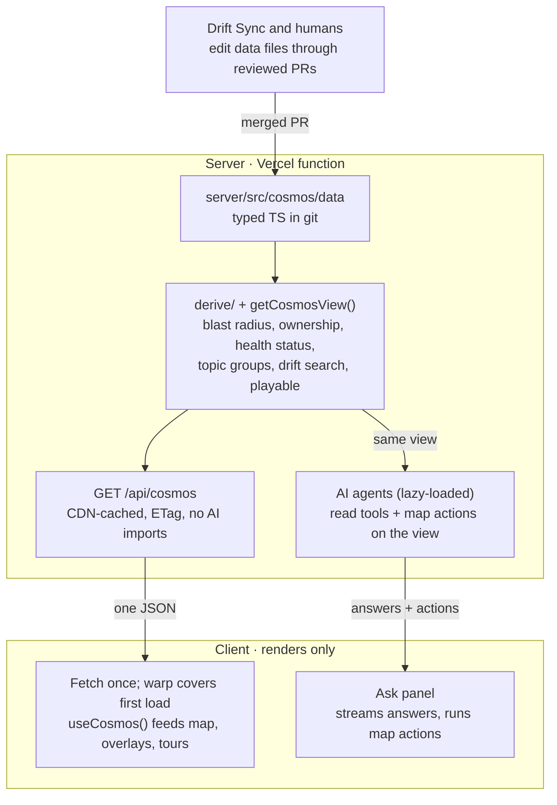

# Stage 1 work brief — P0: Baseline and parity oracle

Plan: docs/plans/server-owned-data-migration-plan.md (branch feature/add-ai). Scope = Phase 0 ONLY, plus building additions A2 (`npm run parity:screens`) and A3 (`npm run cosmos:check`, with at least `--phase 0` working and an extensible structure for later phases). Do NOT start Phase 1.

## Plan: Summary
Project Cosmos today keeps its whole universe (services, topics, scenarios, steps, incidents, owners, drift, health, brand) as typed data in `client/src/scenarios/` and `client/src/incidents/`, and computes system facts (blast radius, ownership, health status, topic groups) in the browser. The AI agents read only `server/src/generated/cosmos-map.json`, a partial snapshot with no payloads, drift, health, on-call or blast radius — so the agent and the UI can disagree, and the `?demo=ai` tour has to fake its answer.

This plan makes the server the single owner of the data and of every derived fact. Data moves to typed TS files under `server/src/cosmos/data/` (still in git, still edited by reviewed PRs and Drift Sync). Pure derive functions compute a frozen view once; one endpoint, `GET /api/cosmos`, returns data plus derived values, CDN-cached with an ETag and isolated from the AI stack. The agents read the same view and gain read tools and map actions. The client fetches once (covered by the hyperspace warp), renders from a React context, and keeps only geometry, animation and layout logic. The migration runs in 14 ordered phases (0–13), each gated by parity against a baseline captured in Phase 0, so the AstroMart map looks and behaves identically throughout.

## Plan: Scope
## Scope

**In scope**

- Phase 0 baseline fixtures (data + derived) and screenshots, as the parity oracle.
- Moving every client data module to `server/src/cosmos/data/` with Zod validation and a complete `validateCosmos()`.
- Replacing hardcoded AstroMart ids in client rendering code with data fields (`clusters`, `nebula`, `ecosystem`, `role`, `groupServiceId`, `palette`).
- Server-side derive modules and `getCosmosView()`.
- `GET /api/cosmos` (ETag, 304, CDN cache headers, no AI imports) and lazy-loading of the AI stack.
- A single-file response type copied to the client, guarded by CI.
- Agents switched to the full view, with read tools, new map actions and a mocked-LLM eval suite.
- Client data layer, loading gate, timeout/error/Retry, and a no-account local dev loop (`npm run dev` runs client + plain Node server + `/api` proxy) from Phase 7 onward.
- Migrating every client feature to `useCosmos()`; moving demo-tour ids and scripted answer into server data.
- Retargeting Drift Sync, validation, `npm run fresh`, skills and `record-demo.mjs` to the new paths.
- Deleting the client data copies, the snapshot and its tooling.
- Docs, dev-only live data reload, fork quickstart, preview + production verification including a deployed-`version` check.
- **A1** — one Playwright end-to-end test of the real loading path, in CI.
- **A2** — `npm run parity:screens`, one command for the screenshot comparison.
- **A3** — `npm run cosmos:check`, one pass/fail migration progress report.

**Out of scope (non-goals)**

- Any database; any write/import/PATCH/DELETE endpoint; auth.
- `cosmosId` or multi-tenancy.
- A shared `packages/` workspace between client and server.
- Visual redesign or new product features beyond the Phase 6 agent tools and map actions.
- Real producers for drift and health data (recorded as follow-up only).
- Splitting `/api/cosmos` into its own Vercel function (only if cold starts stay slow — stop and ask).

## Plan: Ground rules + target architecture
### Ground rules for the executing agent

- Execute phases in order, one phase per branch or commit series; do not start a phase until the previous phase's acceptance passes. The plan targets v1.33.3+; if paths have moved, re-run the Phase 0 inventory and update paths first.
- `CLAUDE.md` wins on process: Conventional Commits, `scripts/version-note.sh write` before every commit, README check on every commit.
- Gates before every commit: `npm run build`, `npm run typecheck`, `npm run lint`, `npm test`. Never run `tsc` without `--noEmit`/`-b`.
- Repo invariants hold throughout: unique global `phaseId`; step `from`/`to`/`via`/`through` resolve; world 2400×1400; capsules ≥150px apart; AstroMart stays fictional.
- UI invariants hold throughout: mobile-first, one panel at a time on phones, top-right close control on every floating panel.
- Demo tours keep working after every phase: `?demo=all` ≤120s, `?demo=ai` ≤60s (`client/src/demo/__tests__/scripts.test.ts` or its current location guards them).
- The AstroMart map must look and behave identically after every phase.
- Ambiguity → smaller change, recorded in `docs/plans/server-owned-data-decisions.md`. Stop conditions are listed at the end.

### Target architecture



The only way data changes is a reviewed PR to the files. The client never computes a system fact.

## Plan: Phase 0 (THIS STAGE)
### Phase 0 — Baseline and parity oracle

No product code changes.

- Run `npm run build`, `npm test`, `npm run validate`, `npm run lint` on `main`; record results in the decisions log. Red `main` → stop.
- **Pause Drift Sync (I5).** Scheduled workflows run from the default branch and `cosmos-sync.yml` is gated by `vars.DRIFT_SYNC_ENABLED`, so pause at the repository level:
  ```
  gh variable set DRIFT_SYNC_ENABLED --body false
  gh pr list --search "head:drift-sync" --state open
  ```
  Merge or close every open Drift Sync PR before capturing the baseline (so the baseline includes or excludes each one deliberately). Record the variable change and each PR's disposition in the decisions log. *Verification:* `gh variable get DRIFT_SYNC_ENABLED` prints `false`; no open Drift Sync PRs. No automated test — this is repository configuration.
- `scripts/dump-baseline.ts` (run with `tsx`) writes `server/src/__tests__/fixtures/baseline-full.json`: `SERVICES` (with `x`, `y`, `width`, `height`, `color`, `hex`, `subServices`), `TOPICS`, `SCENARIOS`, all steps with payloads, `INCIDENTS` with steps, `DOMAINS`, `TEAM_OWNERS`, `FALLBACK_OWNER`, `DRIFT_ENTRIES`, `LATEST_DRIFT_*`, `SERVICE_HEALTH`, `HEALTH_AS_OF`, `BRAND`; plus derived values: `DEPENDENTS_OF`, `TOPIC_GROUPS`, `CONNECTED_NODE_IDS`, the `edge-builder.ts` edge list, `groupServicesByTeam()` output, health status per service.
- Copy `server/src/generated/cosmos-map.json` to `server/src/__tests__/fixtures/baseline-cosmos-map.json`.
- **Screenshot baseline via `npm run parity:screens` (A2).** Build `scripts/parity-screens.mjs`, reusing the Playwright launch/viewport setup from `scripts/record-demo.mjs`. One declarative list of views: default map, each scenario mid-play, each incident replay, blast radius on `payments`, health view, ownership view, drift overlay, changelog open, `realtime-hub` expanded, and the mobile viewport (390px) of the default map. Two modes:
  - `npm run parity:screens -- --update` writes `docs/plans/baseline-screens/<view>.png`.
  - `npm run parity:screens` retakes every view and diffs with `pixelmatch` (dev dependency), printing per-view diff pixel counts and writing `<view>.diff.png` to a gitignored `parity-out/`; exits non-zero if any view exceeds a threshold of 0.1% differing pixels (animations are paused / time is frozen via the same hooks the demo recorder uses, so the threshold only absorbs anti-aliasing).
  Scenario/incident views are driven through the real UI (deep links or clicks), not by setting state. *Verification:* run `--update`, then run without it twice; both runs report 0 views over threshold (proves determinism). Deliberately nudge one capsule `x` locally → the command fails naming that view; revert.
- Record production bundle size and first-map-paint time on `vite preview`.
- Create `docs/plans/server-owned-data-decisions.md` with known issues: `validate.ts` lacks `phaseId` uniqueness, spacing, color-token and incident-step checks despite `CLAUDE.md`; `client/src/scenarios/steps/core.ts` is an unused `npm run fresh` leftover; `drift.ts`/`health.ts` are hand-written fixtures.
- **Progress report scaffold (A3).** Add `scripts/cosmos-check.ts` (run with `tsx`), wired as `npm run cosmos:check`. It runs a table of named checks, each a `git grep` (or file-existence test) with an expected result, and prints `✅/❌ <check> — <offending files>`; exits non-zero if any *active* check fails. Each check carries the phase that activates it; `--phase <n>` (default: all) limits to checks whose phase ≤ n. Initial checks (later phases fill in their own entries as listed below):
  - `phase 0`: baseline fixtures and screenshots exist; decisions log exists.
  *Test:* `scripts/__tests__/cosmosCheck.test.ts` runs the check runner against a temp git repo fixture with one passing and one failing grep check — protects the pass/fail exit code and file listing. Unit layer.

**Acceptance:** fixtures, screenshots and decisions log committed; `npm run parity:screens` green; `npm run cosmos:check -- --phase 0` green.

## Plan: Definition of done / Risks / Stop and ask (reference)
### Definition of done

- No domain data or AstroMart ids in `client/src/` outside tests and `client/src/api/cosmos-api.ts`.
- No `cosmos-map.json` and no snapshot step.
- The agent answers drift, health, on-call, payload and blast-radius questions from data and drives the new map actions.
- The map loads when the AI stack is broken.
- Drift Sync, `npm run fresh`, skills and validation work against `server/src/cosmos/data/`.
- README, `CLAUDE.md` and the decision record describe the new architecture.
- `npm run cosmos:check`, `npm run test:e2e` and `npm run parity:screens` are green.

### Risks

| Risk | Mitigation |
| --- | --- |
| A client feature is missed and breaks after deletion | Phase 8 checklist; A1 E2E and A2 screenshot diff after every row; Phase 11 is one revertible commit |
| Local dev broken mid-migration | No-account dev loop lands first in Phase 7 (I1); A1 boots it in CI |
| Retry stuck on a failed promise | Cached promise cleared on failure, abort on timeout, tested (I2) |
| Client and server shapes drift | Single self-contained `apiTypes.ts` copied by `types:emit`, CI diff (I3) |
| Drift Sync writes to the old path mid-migration | `DRIFT_SYNC_ENABLED=false` + open PRs drained before Phase 1, re-enabled in Phase 10 (I5) |
| Stale CDN data after a deploy | Build-logged `version` compared to production response (I6) |
| Cold starts slow first paint | CDN caching + lazy AI imports (Phase 4); measured in Phase 13 |
| Digest raises AI cost | Token budget check (Phase 6); payloads via tools |
| Scripted demo answer goes stale | Tests tying it to drift data (Phase 9) |

### Stop and ask the owner if

- A Phase 0 baseline command fails on `main`.
- A data value must change to make a test pass — **except** the two Phase 2 changes named above (`color`→`palette`, prefix rule→`groupServiceId`), which are proven by equivalence tests instead.
- Vercel's CDN does not serve a new `version` after a deploy, or cold starts stay slow after lazy imports.
- The gzip size of `/api/cosmos` is over 100 KB (I7).
- The production `version` does not match the build's `COSMOS_VERSION` (I6).
- The digest grows more than 50% and trimming would remove information.
- Any change seems to need a database, write endpoint, auth or shared package.
- A phase would change how the map looks or behaves for a visitor.

## Open Questions

- **Release cut (from the review's Scope Challenge).** Phases 0–6 deliver the agent payoff with the client untouched and are independently shippable. Should increment 1 (Phases 0–6) go to production before Phase 7 starts? This shortens the dual-copy window to one release. Default if unanswered: ship after Phase 6, then continue. Note that Drift Sync stays paused across that release.
- **Screenshot diff threshold.** A2 uses 0.1% differing pixels; confirm in Phase 0 by running the comparison twice on an unchanged build, and record the chosen value in the decisions log.

## Plan: Additions A2 + A3 (build in this stage)
| # | Category | Value | Conf | Title | Detected by | Size | Session % | Description |
| A2 | Testing | 🟡 Medium value | C2 | One command for the screenshot comparison | gemini, grok | M | 8% | Turn the Phase 0 Playwright screenshot list into `npm run parity:screens`. It retakes every baseline view and reports the pixel differences against `docs/plans/baseline-screens/`. Phases 2, 8, 11 and 13 all compare screenshots, and Phase 8 does it once per feature row. <br><br> **Before Add:** About twenty manual screenshot comparisons, repeated across many phases, and every one is easy to skip or misjudge. <br><br> **After Add:** One command shows exactly which views look different from before the migration. |
| A3 | DX | 🟡 Medium value | C3 | One command that reports migration progress | preplexity, gpt, z.ai | S | 3% | `npm run cosmos:check` runs the plan's scattered greps as one pass/fail report: hardcoded ids in client code (Phase 2), client files that still import the old data (Phase 8), tools that still point at the old paths (Phase 10), and every Definition-of-done item. It can be a small `tsx` script over `git grep`. <br><br> **Before Add:** You copy several long search commands out of the plan and read their output by eye to decide whether a phase is done. <br><br> **After Add:** One command says which items are finished and which files still need moving. |

## Plan: Issue I5 (Drift Sync pause — relevant to this stage)
| ID | Title | Detected by | Description | Resolution | Notes |
| I5 | Pausing Drift Sync by editing the workflow file does not pause it | Claude, z.ai | Phase 1 pauses Drift Sync by disabling the cron in `cosmos-sync.yml`. Scheduled GitHub workflows run only from the copy of that file on the default branch, so editing it on a phase branch changes nothing until that branch merges. The workflow is actually switched on by the repository variable `DRIFT_SYNC_ENABLED`, not by the cron line. Drift Sync PRs that are already open would also still edit `client/src/scenarios/` if they merge mid-migration. Example: a PR opened the night before Phase 1 merges during Phase 5. Now the client copy has a change the server copy lacks, and the parity test blocks every later phase. <br><br> **Before Fix:** The nightly bot can keep editing the old files while you move them, and the two copies of the data quietly stop matching. <br><br> **After Fix:** The bot is really switched off for the whole move, and nothing it opened earlier can land halfway through. | Fixed | Verified: `cosmos-sync.yml:72` gates on `vars.DRIFT_SYNC_ENABLED == 'true'`. Pause via `gh variable set`, drain open Drift Sync PRs, re-enable in Phase 10. |
