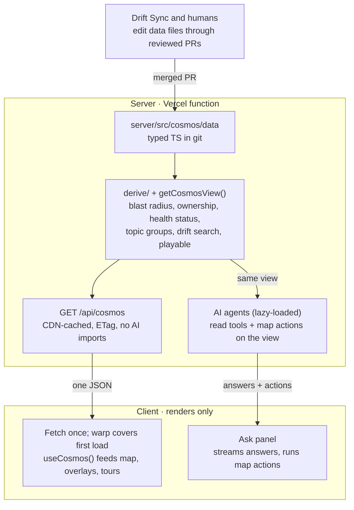

# Stage 5 work brief — P4 + P5: GET /api/cosmos, lazy AI imports, print-cosmos-version, types:emit + CI diff

Plan: docs/plans/server-owned-data-migration-plan.md (Phases 4 and 5 below are pasted verbatim; the
ground rules, stop list and target architecture follow for context). Stages 1–4 (Phases 0–3) are
committed — see the ledger. `getCosmosView()` already exists in `server/src/cosmos/view.ts`.

Orchestrator notes for this stage:
- **No Vercel deploy from this stage.** The two preview checks in Phase 4 ("second request is
  `x-vercel-cache: HIT`", "a second preview from a data change serves the new `version`") are an
  outward-facing action — do not deploy. List them under `## Open questions` as manual checks, and
  verify locally what can be verified (headers, ETag/304, version changes when the view changes).
- `data.demo` arrives in Phase 9 and `data.clusters` may or may not exist yet in the view — return
  what `getCosmosView()` has now; record any key the plan lists that isn't present yet in the
  decisions log rather than inventing data.
- Gzip size > 100 KB is a stop condition (I7). If close, consider the Stage 4 note: drop
  `playable.stepsById` from the payload. Over the limit → write a blocker, don't guess.
- Add a `cosmos:check` phase 4 and phase 5 entry set (follow the existing pattern in
  `scripts/cosmos-check.ts`).

### Ground rules for the executing agent

- Execute phases in order, one phase per branch or commit series; do not start a phase until the previous phase's acceptance passes. The plan targets v1.33.3+; if paths have moved, re-run the Phase 0 inventory and update paths first.
- `CLAUDE.md` wins on process: Conventional Commits, `scripts/version-note.sh write` before every commit, README check on every commit.
- Gates before every commit: `npm run build`, `npm run typecheck`, `npm run lint`, `npm test`. Never run `tsc` without `--noEmit`/`-b`.
- Repo invariants hold throughout: unique global `phaseId`; step `from`/`to`/`via`/`through` resolve; world 2400×1400; capsules ≥150px apart; AstroMart stays fictional.
- UI invariants hold throughout: mobile-first, one panel at a time on phones, top-right close control on every floating panel.
- Demo tours keep working after every phase: `?demo=all` ≤120s, `?demo=ai` ≤60s (`client/src/demo/__tests__/scripts.test.ts` or its current location guards them).
- The AstroMart map must look and behave identically after every phase.
- Ambiguity → smaller change, recorded in `docs/plans/server-owned-data-decisions.md`. Stop conditions are listed at the end.

### Target architecture



The only way data changes is a reviewed PR to the files. The client never computes a system fact.

### Phase 4 — The cosmos API route

Response:

```
{
  "version": "<sha256 of serialized view, first 16 hex>",
  "data":    { brand, domains, clusters, services, topics, scenarios, incidents, owners, drift, health, demo },
  "derived": { edges, connectedNodeIds, blastRadius, ownership, topicGroups, healthStatus, latestDrift, driftSearchText, playable }
}
```

- Read `server/src/app.ts` first; match its `/api` prefixing, `notFound`, `onError`. Add the route beside `/ai/*`. It imports only `cosmos/view.ts`.
- Compute `version` and the serialized body once per process. Export `getCosmosVersion()` from `view.ts` for the build log (I6).
- `ETag: "<version>"`; 304 on matching `If-None-Match`. `Cache-Control: public, max-age=60, s-maxage=31536000, stale-while-revalidate=86400`. Verify on a preview that the second request is `x-vercel-cache: HIT`, and that a second preview built from a data change serves the new `version` (record both).
- **Build prints the version (I6).** Add `server/scripts/print-cosmos-version.ts` and call it from the server build script so every Vercel build log contains `COSMOS_VERSION=<version>`. Phase 13 compares against it.
- **Isolate the AI stack.** Move `import { answerQuestion } from './agent/askAnswer.js'` and every import that pulls LangChain, LangGraph or provider SDKs into `await import()` inside the `/ai/*` handlers.
- *Tests* in `server/src/__tests__/cosmosRoute.test.ts` via `app.request()`: 200 with full shape that parses with the Zod schema; 304 with matching ETag; exact `Cache-Control`/`ETag` headers — protects the HTTP contract the client and CDN depend on. `server/src/__tests__/cosmosIsolation.test.ts`: import `app.ts` with agent modules mocked to throw on load; `GET /api/cosmos` still 200 — protects "map loads when AI is broken". Unit/integration-in-process layer.
- Record gzip size in the decisions log. Over 100 KB is a stop condition (I7).
- Slow cold starts on preview after lazy imports → stop and ask before splitting the function.

**Acceptance:** tests pass; preview shows CDN HIT on the second request; broken agent import does not break the route; gzip ≤100 KB.

### Phase 5 — API contract and client types

The server owns the response type; the client receives a byte-for-byte copy of one self-contained file (I3). This copies shape, never data, so it respects the no-shared-package rule and avoids pulling Zod/Hono types into the client build.

- `server/src/cosmos/apiTypes.ts` contains `CosmosResponse` and every type it references, with **no imports** and no runtime code. `types.ts` re-exports from it. `schema.ts` declares `CosmosResponseSchema satisfies z.ZodType<CosmosResponse>`, so a type/schema mismatch is a compile error.
- `server/scripts/emit-client-types.ts`, wired as root `npm run types:emit`, reads `apiTypes.ts`, fails if it contains any `import`/`export … from` line, prepends `// GENERATED from server/src/cosmos/apiTypes.ts by npm run types:emit — do not edit.` and writes `client/src/api/cosmos-api.ts`. No `tsc` involved.
- CI step in `.github/workflows/validate-on-pr.yml`: `npm run types:emit` then `git diff --exit-code client/src/api/cosmos-api.ts`.
- *Tests:* `server/scripts/__tests__/emitClientTypes.test.ts` — output equals header + source; an input with an import line is rejected (protects the single-file invariant). The `satisfies` in `schema.ts` is enforced by `npm run typecheck`. Unit layer.
- Client runtime guard in the fetch layer: `version` is a string and every top-level `data`/`derived` key exists. Full validation stays server-side.

**Acceptance:** editing a field in `apiTypes.ts` without re-running `types:emit` fails CI; client typechecks against `cosmos-api.ts`.

### Stop and ask the owner if

- A Phase 0 baseline command fails on `main`.
- A data value must change to make a test pass — **except** the two Phase 2 changes named above (`color`→`palette`, prefix rule→`groupServiceId`), which are proven by equivalence tests instead.
- Vercel's CDN does not serve a new `version` after a deploy, or cold starts stay slow after lazy imports.
- The gzip size of `/api/cosmos` is over 100 KB (I7).
- The production `version` does not match the build's `COSMOS_VERSION` (I6).
- The digest grows more than 50% and trimming would remove information.
- Any change seems to need a database, write endpoint, auth or shared package.
- A phase would change how the map looks or behaves for a visitor.
