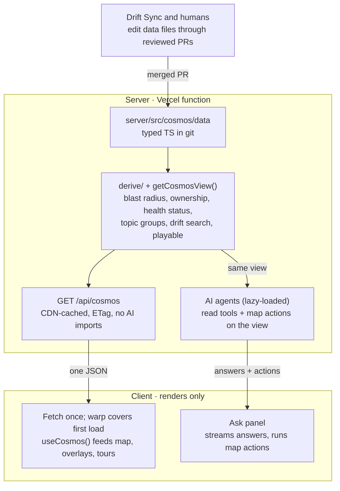

# Stage 8 work brief — P8: Migrate every client feature

Stage plan line: migrate every client feature to useCosmos(), renderWithCosmos fixture, Ask map-action handlers (~1,400 LOC, flagged large).
Plan: docs/plans/server-owned-data-migration-plan.md. No spec file. Plan text pasted verbatim below.

## Plan — Issue Resolutions (context)
## Issue Resolutions

| ID | Title | Detected by | Description | Resolution | Notes |
|----|-------|-------------|-------------|------------|-------|
| I1 | Local development stops working from Phase 7 until Phase 12 | Claude, gpt | Phase 7 makes the app wait for `/api/cosmos` before it draws the map. Locally, nothing answers that request: `npm run dev` starts only Vite (the client dev server), and `client/vite.config.ts` has no `/api` proxy (a rule that forwards API calls to the server). The task "reuse the existing `/api` proxy" points at something that does not exist. Today the AI features run locally only through `vercel dev`, as the README says. So from Phase 7 on, every local run shows the warp for 10 seconds and then the error screen. That blocks the Phase 8 screenshot checks, `npm run record:demo` and the demo-tour timing runs. The proper dev setup only arrives in Phase 12, which also says to "reuse how the server runs today". Today that means `vercel dev`, which needs `vercel link` and a login. That breaks the Phase 12 promise that a fresh fork clone reaches a running map with only `npm run dev`.    **Before Fix:** Halfway through the migration, opening the app on your own computer shows a loading animation and then an error. You can't check your work or record the demo, and anyone who forks the project needs a Vercel account just to see the map.    **After Fix:** One command starts the whole app on your computer at every phase, with no account needed, so every check in the plan can actually be run. | Fixed | Dev loop (Node runner on :8787 via `@hono/node-server` + `tsx watch`, Vite `/api` proxy, `concurrently`) moved into Phase 7, first task. Phase 12 keeps only live-data polling and docs. |
| I2 | Retry repeats the failed request instead of trying again | gpt, z.ai | Phase 7 says `startCosmosFetch()` keeps the request it started and returns that same request on every call. If the first attempt fails or hits the 10-second timeout, the stored request is a failure. Retry then calls `startCosmosFetch()` and gets the same failure back at once. Example: the API is down when the page opens, the error screen appears, the API comes back, and the user presses Retry. The error stays, so the Phase 7 acceptance check ("Retry recovers") cannot pass.    **Before Fix:** Once loading fails, the Retry button does nothing, and the user has to reload the whole page.    **After Fix:** Pressing Retry really tries again, and the map opens as soon as the server is back. | Fixed | `cosmosClient.ts` clears its cached promise on rejection and aborts via `AbortController` on timeout; test "fails then succeeds after Retry". |
| I3 | The type-generation step will not produce the single file the plan expects | gpt | Phase 5 runs `tsc --declaration --emitDeclarationOnly` on `apiTypes.ts`. That file is allowed to import `types.ts`. The TypeScript compiler writes one declaration file (`.d.ts`, a types-only copy of a code file) for every source file it reads, and it names each output after its source. So the command writes `apiTypes.d.ts` and `types.d.ts`, not one `client/src/api/cosmos-api.d.ts`. The `--outFile` option can't combine them for this project's module setting (NodeNext). The CI check (`git diff --exit-code client/src/api/`) would then guard files the client does not import.    **Before Fix:** The step that should keep the browser and the server agreeing on the data's shape writes the wrong files. The safety check then watches files nobody uses.    **After Fix:** The browser gets one exact copy of the server's data description, and CI fails the moment the two stop matching. | Fixed | `apiTypes.ts` is self-contained (no imports); `types.ts` re-exports it; `schema.ts` uses `satisfies z.ZodType<CosmosResponse>`; `types:emit` copies the file with a header, no compiler. |
| I4 | Phase 2 has to change existing values, which the plan forbids | Claude (adversarial) | Phase 2 replaces each service's `color: 'var(--svc-cyan)'` with a `palette: 'cyan'` key. It also replaces topic grouping by name prefix with an explicit `groupServiceId`. Both remove or change values that `baseline-full.json` records. But Phase 2 says "existing values must not change", and the stop list says to stop whenever "a data value must change to make a test pass". If the executing agent follows the plan exactly, it either stops at Phase 2 or keeps `color` forever, and then the coupling to `tokens.css` the phase set out to remove stays.    **Before Fix:** The plan's own rules contradict each other at Phase 2. The migration either stalls or quietly leaves the old color setup in place.    **After Fix:** Phase 2 can finish, and tests prove the colors and groupings still look exactly the same. | Fixed | Phase 2 names exactly two allowed fixture changes (`color`→`palette`, prefix rule→`groupServiceId`), each proven by an equivalence test; the stop rule carves out these two. |
| I5 | Pausing Drift Sync by editing the workflow file does not pause it | Claude, z.ai | Phase 1 pauses Drift Sync by disabling the cron in `cosmos-sync.yml`. Scheduled GitHub workflows run only from the copy of that file on the default branch, so editing it on a phase branch changes nothing until that branch merges. The workflow is actually switched on by the repository variable `DRIFT_SYNC_ENABLED`, not by the cron line. Drift Sync PRs that are already open would also still edit `client/src/scenarios/` if they merge mid-migration. Example: a PR opened the night before Phase 1 merges during Phase 5. Now the client copy has a change the server copy lacks, and the parity test blocks every later phase.    **Before Fix:** The nightly bot can keep editing the old files while you move them, and the two copies of the data quietly stop matching.    **After Fix:** The bot is really switched off for the whole move, and nothing it opened earlier can land halfway through. | Fixed | Verified: `cosmos-sync.yml:72` gates on `vars.DRIFT_SYNC_ENABLED == 'true'`. Pause via `gh variable set`, drain open Drift Sync PRs, re-enable in Phase 10. |
| I6 | Checking a single preview cannot prove that a deploy publishes new data | grok, preplexity | Phase 4 sets a one-year CDN cache (`s-maxage=31536000`). It relies on "each deployment has its own CDN cache" and verifies that on one preview. One preview only proves that the second request is a cache hit. It can't show that the next production deploy serves new data instead of last year's cached copy. Phase 13 also checks only `x-vercel-cache: HIT` on production, and that check stays green even when the data is stale.    **Before Fix:** A release could keep showing the old map to visitors, and every check would still pass.    **After Fix:** Each release proves that the live site shows the data that was just deployed. | Fixed | Build prints the computed `version`; Phase 13 compares production `/api/cosmos` `version` against it; mismatch is a stop condition. |
| I7 | No stated action when the response is over its size target | z.ai | Phase 4 says to record the compressed size of `/api/cosmos` and gives a 100 KB target. It does not say what to do if the response is bigger. Every other target in the plan has a "stop and ask" rule, so the executing agent has to guess here.    **Before Fix:** If the data comes out too big, whoever is doing the work has to decide alone whether that's acceptable.    **After Fix:** A response that's too big pauses the work, and the owner decides. | Fixed | Added to the stop list. |

### Ground rules for the executing agent

- Execute phases in order, one phase per branch or commit series; do not start a phase until the previous phase's acceptance passes. The plan targets v1.33.3+; if paths have moved, re-run the Phase 0 inventory and update paths first.
- `CLAUDE.md` wins on process: Conventional Commits, `scripts/version-note.sh write` before every commit, README check on every commit.
- Gates before every commit: `npm run build`, `npm run typecheck`, `npm run lint`, `npm test`. Never run `tsc` without `--noEmit`/`-b`.
- Repo invariants hold throughout: unique global `phaseId`; step `from`/`to`/`via`/`through` resolve; world 2400×1400; capsules ≥150px apart; AstroMart stays fictional.
- UI invariants hold throughout: mobile-first, one panel at a time on phones, top-right close control on every floating panel.
- Demo tours keep working after every phase: `?demo=all` ≤120s, `?demo=ai` ≤60s (`client/src/demo/__tests__/scripts.test.ts` or its current location guards them).
- The AstroMart map must look and behave identically after every phase.
- Ambiguity → smaller change, recorded in `docs/plans/server-owned-data-decisions.md`. Stop conditions are listed at the end.

## Plan — Target architecture
### Target architecture

The only way data changes is a reviewed PR to the files. The client never computes a system fact.

## Plan — Phase 8 (THIS STAGE)
### Phase 8 — Migrate every client feature

One feature per commit; after each commit run `npm run parity:screens` and `npm run test:e2e`.

Rules:
- Module-load computations (`DEPENDENTS_OF`, `TOPIC_GROUPS`, `CONNECTED_NODE_IDS`, edge list) are deleted, not converted; values come from `derived`.
- Rendering-only derivations (edge geometry, comet paths) become `useMemo` keyed on `version`.
- Client copies of server logic are deleted in the commit that stops using them.
- Changelog search: the client substring-filters `derived.driftSearchText`; matching rules exist once.

| Feature | Client files | Reads | Done |
| --- | --- | --- | --- |
| Map, capsules, edges, comets, ambient packets | `Map.tsx`, `edge-builder.ts`, `edge-resolver.ts`, `AmbientPackets.tsx` | `services`, `topics`, `derived.edges`, `derived.playable` | [ ] |
| Cluster backdrops and nebulae | `*Cluster.tsx`, `NebulaField.tsx` | `clusters` | [ ] |
| Service ecosystem (`realtime-hub`) | `Map.tsx`, `edge-resolver.ts` | `services[].ecosystem` | [ ] |
| Topic grouping | `topic-groups.ts` (deleted) | `derived.topicGroups` | [ ] |
| Scenario player, stepper, step panel, activity log | `runner.ts`, step components | `derived.playable` | [ ] |
| Incident list, banner, replay | incident components | `incidents`, `derived.playable` | [ ] |
| Quick search (`/`) | `Spotlight.tsx` | `services`, `topics`, `scenarios`, `incidents` | [ ] |
| Service, topic, sub-service passports | passport components | `services`, `derived.ownership`, `brand.repoBaseUrl` | [ ] |
| Blast radius (`B`) | `blast-radius.ts` (deleted) | `derived.blastRadius` | [ ] |
| Health heat map, on-call card (`H`) | health components | `health`, `derived.healthStatus` | [ ] |
| Ownership view (`O`) | ownership components | `derived.ownership`, `owners` | [ ] |
| What changed (`C`), drift footer | `DriftFooter.tsx`, drift overlay | `derived.latestDrift`, `brand.driftSyncUrl` | [ ] |
| Architecture changelog, warp to node | `ChangelogPanel.tsx`, `App.tsx` | `drift`, `derived.driftSearchText` | [ ] |
| Deep links | deep-link parser | `domains`, `derived.playable` | [ ] |
| Intro, help modal, badge | `IntroOverlay.tsx`, `HelpModal.tsx` | `brand` | [ ] |
| Layout edit mode | `Map.tsx` | `services[].x/y` base; `localStorage` overrides stay | [ ] |
| Ask panel map actions | Ask panel, `askTouches` | handlers for Phase 6 actions | [ ] |
| Demo tours | `demo/*` | done in Phase 9 | [ ] |

Tasks:
- Test helper `client/src/__tests__/renderWithCosmos.tsx` renders inside `CosmosProvider` with `client/src/__tests__/fixtures/cosmos-response.json`, generated by `scripts/dump-cosmos-response.ts` from the real route via `app.request()` — never hand-written.
- Move the 3 client tests that import data directly onto the fixture.
- Client handlers for `show_blast_radius`, `open_passport`, `show_health`, `show_ownership`, `open_changelog_entry`. *Test:* `client/src/__tests__/askMapActions.test.tsx` — each action, given fixture ids, opens the matching overlay/panel and respects the one-panel-at-a-time policy on a phone viewport. Component layer.
- A3 check added: `phase 8`: `grep -rn "scenarios/\|incidents/" client/src --include=*.ts --include=*.tsx | grep -v __tests__` returns only the old data files.

**Acceptance:** every row ticked; `npm run cosmos:check -- --phase 8` green; all tests, `parity:screens` and `test:e2e` pass.

## Plan — Definition of done / Risks / Stop list
### Definition of done

- No domain data or AstroMart ids in `client/src/` outside tests and `client/src/api/cosmos-api.ts`.
- No `cosmos-map.json` and no snapshot step.
- The agent answers drift, health, on-call, payload and blast-radius questions from data and drives the new map actions.
- The map loads when the AI stack is broken.
- Drift Sync, `npm run fresh`, skills and validation work against `server/src/cosmos/data/`.
- README, `CLAUDE.md` and the decision record describe the new architecture.
- `npm run cosmos:check`, `npm run test:e2e` and `npm run parity:screens` are green.

### Risks

| Risk | Mitigation |
| --- | --- |
| A client feature is missed and breaks after deletion | Phase 8 checklist; A1 E2E and A2 screenshot diff after every row; Phase 11 is one revertible commit |
| Local dev broken mid-migration | No-account dev loop lands first in Phase 7 (I1); A1 boots it in CI |
| Retry stuck on a failed promise | Cached promise cleared on failure, abort on timeout, tested (I2) |
| Client and server shapes drift | Single self-contained `apiTypes.ts` copied by `types:emit`, CI diff (I3) |
| Drift Sync writes to the old path mid-migration | `DRIFT_SYNC_ENABLED=false` + open PRs drained before Phase 1, re-enabled in Phase 10 (I5) |
| Stale CDN data after a deploy | Build-logged `version` compared to production response (I6) |
| Cold starts slow first paint | CDN caching + lazy AI imports (Phase 4); measured in Phase 13 |
| Digest raises AI cost | Token budget check (Phase 6); payloads via tools |
| Scripted demo answer goes stale | Tests tying it to drift data (Phase 9) |

### Stop and ask the owner if

- A Phase 0 baseline command fails on `main`.
- A data value must change to make a test pass — **except** the two Phase 2 changes named above (`color`→`palette`, prefix rule→`groupServiceId`), which are proven by equivalence tests instead.
- Vercel's CDN does not serve a new `version` after a deploy, or cold starts stay slow after lazy imports.
- The gzip size of `/api/cosmos` is over 100 KB (I7).
- The production `version` does not match the build's `COSMOS_VERSION` (I6).
- The digest grows more than 50% and trimming would remove information.
- Any change seems to need a database, write endpoint, auth or shared package.
- A phase would change how the map looks or behaves for a visitor.

## Additions A2/A3 (accepted; tooling exists from stage 1)
| A2 | Testing | 🟡 Medium value | C2 | One command for the screenshot comparison | gemini, grok | M | 8% | Turn the Phase 0 Playwright screenshot list into `npm run parity:screens`. It retakes every baseline view and reports the pixel differences against `docs/plans/baseline-screens/`. Phases 2, 8, 11 and 13 all compare screenshots, and Phase 8 does it once per feature row.    **Before Add:** About twenty manual screenshot comparisons, repeated across many phases, and every one is easy to skip or misjudge.    **After Add:** One command shows exactly which views look different from before the migration. |
| A3 | DX | 🟡 Medium value | C3 | One command that reports migration progress | preplexity, gpt, z.ai | S | 3% | `npm run cosmos:check` runs the plan's scattered greps as one pass/fail report: hardcoded ids in client code (Phase 2), client files that still import the old data (Phase 8), tools that still point at the old paths (Phase 10), and every Definition-of-done item. It can be a small `tsx` script over `git grep`.    **Before Add:** You copy several long search commands out of the plan and read their output by eye to decide whether a phase is done.    **After Add:** One command says which items are finished and which files still need moving. |

## Orchestrator notes
- Stage 6 ledger: new NDJSON action kinds Phase 8 must handle by exactly these names: `showBlastRadius {nodeId}`, `openPassport {nodeId}`, `showHealth`, `showOwnership`, `openChangelogEntry {entryId}` — today `parseAskStreamLine` maps them to null; `client/src/__tests__/askUnknownAction.test.ts` proves unknown actions are no-ops (keep that true). Stage 6 also noted the `demo=ai` tour should show these actions once the client handles them (CLAUDE.md invariant: every AI change is reflected in `demo=ai`, ≤60s; `demo=all` ≤120s guarded by `scripts.test.ts`).
- Stage 7 ledger: every component migration must render inside `CosmosProvider` (the shell only); re-run `npm run test:e2e` after each row. `useCosmos()` throws `NO_COSMOS_PROVIDER` outside the provider. Load state is in `client/src/api/useCosmosLoad.ts`.
- `npm run parity:screens` (16 baselines, retaken in stage 7) and `npm run cosmos:check -- --phase 8` are the acceptance tools; add the phase-8 checks to `scripts/cosmos-check.ts` if the plan's Phase 8 acceptance greps aren't already wired.
- An unrelated Vite may hold :5173/:5174 — stage 7 ran e2e with `BASE_URL=http://localhost:5175`.
- Do NOT delete the client data copies (`client/src/scenarios/`, `client/src/incidents/`, generated snapshot) — that is Phase 11 / stage 10. Phase 9 (drift/health/demo data server-side, demo scripts rewrite) is stage 9 — out of scope unless Phase 8 text explicitly requires it.
- Sizing: this stage is flagged large; the file ceiling is advisory here — keep each edit tight, and record any ambiguity in `docs/plans/server-owned-data-decisions.md` (smaller change wins).
- The plan's "one feature per commit" is superseded by /master's process: you make NO commits; the whole stage lands as one reviewed commit. Still run `parity:screens` + `test:e2e` after each feature row (or at least after each group of rows) so a regression is pinned to the row that caused it, and list per-row results in the report.
