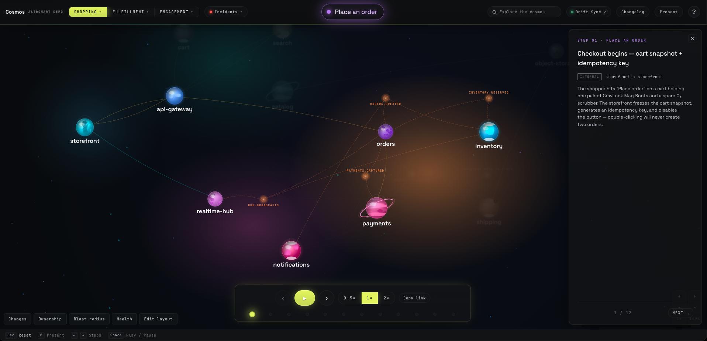

# Project Cosmos

[](https://github.com/orassayag/project-cosmos/actions/workflows/validate-on-pr.yml)
[](https://project-cosmos-six.vercel.app/)
[](https://github.com/orassayag/project-cosmos/releases)
[](LICENSE)

> **About this fork**
>
> This project is an extended version of [Cosmos OS](https://github.com/ludeo-labs/cosmos-os).
> The original project was created by [Omer Sher](https://github.com/ludeo-labs) at
> [Ludeo](https://ludeo.com) and is licensed under the MIT License. I extended it with
> incident replay (curated production incidents replayed on the map), blast-radius analysis,
> a service health heat map with on-call cards, an ownership view, a "what changed last night"
> drift overlay with a status footer pill, a browsable architecture changelog, an
> "Ask the agent" natural-language question panel, a presentation mode for talks,
> an on-map step stepper, and a richer visual layer (planet morphology, nebula
> fields, parallax panning, and star explosions).

**A living map of your architecture.** Every service is a star. Kafka topics orbit between them. Real flows play as comets you can watch, pause, and inspect — payloads included. And a nightly AI agent keeps the whole map honest against your actual code.

<p align="center">
  <a href="https://project-cosmos-six.vercel.app/"><b>▶ Live demo</b></a> ·
  <a href="#quickstart">Quickstart</a> ·
  <a href="#make-it-your-cosmos">Make it yours</a> ·
  <a href="#drift-sync">Drift Sync</a>
</p>

<p align="center">
  
</p>

## Why

Every architecture diagram starts dying the moment it's born. The wiki page is from two reorgs ago, the Lucidchart link is stale, and the only reliable documentation is a senior engineer with a whiteboard. Project Cosmos takes a different bet:

1. **The map is the source, not a mirror.** Everything you see — services, topics, flows — is one set of plain TypeScript files. No backend, no database, no sync job to a diagramming SaaS.
2. **Flows are playable, not drawn.** A scenario is a real request traced hop-by-hop: URL, headers, payload, what got produced to which topic, what got written to which database. Press play and watch it fly.
3. **Honesty is automated.** A nightly agent diffs your repos against the map and opens one PR per team when reality moved. Forgetting to update the docs stops being an option.

## What's in the box

- 🗺️ **The map** — an animated SVG cosmos of your services (capsules), Kafka topics (orbitals), and protocol-colored connections (HTTP amber, WebSocket cyan, Kafka orange).
- 🎬 **Scenario player** — named end-to-end flows play as comets along real curved paths, with a step panel showing the actual request/response payloads at every hop. Deep-linkable (`?domain=…&scenario=…&step=…`).
- 🚨 **Incident replay** — pick a past production incident from the **Incidents** list and press play. The map replays the exact path the failing request (or cascade) took, with the real (redacted) payloads captured at the time, a red comet, and a banner so it never reads as live traffic. No AI — just human-curated recordings. Deep-linkable (`?incident=…&step=…`).
- 🔎 **Quick search** — press `/` anywhere and start typing: services, topics and scenarios rank together in one palette, and picking a result warps the map straight to it.
- 📜 **Live activity log** — a running `LIVE · ACTIVITY` feed of every step as it fires during playback, so you can read the whole path at once instead of one step at a time.
- 🔍 **Service passports** — click any star: owner team, repo link, stack, databases, and why it exists.
- 🪐 **Service ecosystems** — umbrella services expand into a mini solar system of sub-services; packets re-route through the internals during playback.
- 🔦 **Blast radius** — click a service or topic and the map ranks everything that would break if you changed it, HIGH → MED → LOW. It walks the real dependency graph, which reverses direction for synchronous calls versus Kafka hand-offs, so the answer is genuine impact, not just "what's connected."
- 🌡️ **Service health heat map** — stars tint by commit age and open-PR backlog (fresh → warm → hot); click one for its on-call card: who's holding the pager, until when, and which Slack channel to escalate in.
- 👥 **Ownership view** — an ownership legend that isolates everything a team owns with one click, so a crowded galaxy collapses to just one team's surface.
- 📽️ **Presentation mode** — `P` strips the UI back to the bare map and fattens the comets so a scenario reads from the back of the room; the arrow keys and space still drive playback with the controls hidden.
- ✏️ **Layout edit mode** — hit `Edit layout` (or press `L`), drag stars and topics where you want them, then `Copy coords` and paste the values into the data files. Try it in the [live demo](https://project-cosmos-six.vercel.app/) — your rearrangement stays in your browser only.
- 🤖 **Two Claude skills** — `/add-service` and `/add-scenario` teach [Claude Code](https://claude.com/claude-code) to interrogate your repos and grow the map for you: who do you call, what do you produce, to which topic, what database are you hiding.
- 🌙 **Drift Sync** — the nightly honesty robot. Diffs every tracked repo against a baseline SHA, filters noise with cheap regexes, asks an AI agent "does the map still tell the truth?", and opens one tidy PR per team with file:line evidence. A footer status pill links straight to the latest run on GitHub Actions.
- ✨ **What changed last night** — after a nightly run, the affected services and topics glow on the map in their change color; the overlay lists each finding with a link to the draft PR the pipeline raised.
- 🗞️ **Architecture changelog** — the drift history as a browsable "added / changed / risk / removed" list; click an item to warp the map into that commit's context and jump to its PR or the affected node.
- 💬 **Ask the agent** — a natural-language question box over the whole architecture. It ships as a self-aware UI demo in the open-source build (no model wired up); point it at a model to make it answer for real.

## Quickstart

Requires Node ≥ 20.

```bash
git clone https://github.com/orassayag/project-cosmos.git
cd project-cosmos
npm install
npm run dev
```

Open http://localhost:5173 — you're looking at **AstroMart**, a fictional space-gear e-commerce platform that ships with the repo as demo data. Pick a domain, choose a scenario (start with *Place an order*), press play.

### Driving it from the keyboard

Everything the map does is reachable without the mouse:

| Key | What it does |
|---|---|
| `/` | Quick search — jump to any service, topic or scenario |
| `Space` | Play / pause the current scenario |
| `←` `→` | Previous / next step |
| `P` | Presentation mode — hide the chrome for a talk |
| `B` | Blast radius |
| `H` | Service health heat map |
| `O` | Ownership view |
| `C` | What changed last night (only once a drift run has landed) |
| `L` | Layout edit mode |
| `+` `−` | Zoom in / out |
| `0` | Reset the zoom |
| `Esc` | Reset the galaxy — clears the scenario, filters, selection and URL |

Mouse equivalents: drag the background to pan, scroll to zoom around the cursor, click any star or topic to open its panel.

## Make it your cosmos

The entire universe lives in `client/src/scenarios/` — plain, typed TypeScript:

| Concept | What it is | Where |
|---|---|---|
| **Service** | A deployed process → a capsule on the map | `services.ts` |
| **Topic** | A Kafka topic used as an edge → an orbital node | `topics.ts` |
| **Domain** | A group of related scenarios | `scenarios.ts` |
| **Scenario** | A named, playable end-to-end flow | `scenarios.ts` |
| **Step** | One hop: from → to, protocol, payload | `steps/*.ts` |
| **Incident** | A past production incident, frozen in time and replayable | `client/src/incidents/*.ts` |

**Start from the template:** click **Use this template** on GitHub (or clone), then:

```bash
npm install
npm run fresh   # replaces AstroMart with a minimal 2-star starter cosmos
npm run dev     # your galaxy, ready to grow
```

Two ways to populate it:

**With Claude Code (recommended)** — the repo ships with two skills. Open the repo (plus your service repos) in a Claude Code workspace and say:

```
/add-service payments
/add-scenario show me what happens when a customer checks out
```

You can also install the skills into any environment as a plugin, no clone needed:

```
/plugin marketplace add orassayag/project-cosmos
/plugin install cosmos@project-cosmos
```

…then use `/cosmos:add-service` and `/cosmos:add-scenario` anywhere.

The skills make Claude read your actual source — call sites, producers, consumers, schemas — and write verified entries. No guessing allowed; the skill files are the guardrails.

**By hand** — copy any AstroMart entry, follow the shapes in `types.ts`, and keep three invariants: unique ids, `hex` matches the color token, and `phaseId`s are global and never reused. `npm run build` type-checks everything, and `npm run validate` is the data sanity gate — it checks that every `from`/`to`/`via`/`through` resolves to a real service or topic, that `phaseId`s are unique, that capsules keep their minimum spacing, and that the committed map snapshot (`server/src/generated/cosmos-map.json`) is fresh — run `npm run snapshot` after any data edit. Both run in CI on every PR (the **Validate** badge above), alongside `npm run lint`.

Placing nodes is easiest visually: enter **Edit layout** mode, drag things into place, `Copy coords`, and paste the numbers back into `services.ts` / `topics.ts`. Topics normally auto-arrange in a ring around their owning service — if a ring slot collides with a neighbor, set `pinned: true` on the topic and it fans out to your hand-placed coordinates instead.

To start clean, empty the arrays in `services.ts`, `topics.ts`, `scenarios.ts`, and `steps/`, then grow your own sky.

## Record a production incident

An incident is just a scenario frozen in time. Recordings live in `client/src/incidents/` (one file per incident); the app discovers, lists, and plays them automatically — no AI, no backend, no database. Recording one takes 10–30 minutes for someone who already has the logs:

1. **Open the closest scenario** in `client/src/scenarios/steps/` (or start blank) and note the hops the failing request actually took.
2. **Copy the relevant steps** and replace the example payloads with the real ones from the logs — redact card/customer/token fields (`"[redacted]"`).
3. **Add the title, date, and a one- or two-sentence note** describing what went wrong.
4. **Give it a globally-unique `phaseId`** (incidents use `101+` so they never collide with scenarios) and set every step's `phase` to that same id.
5. **Save the file** under `client/src/incidents/`, import it in `client/src/incidents/data.ts`, and drop it into the `INCIDENTS` array. `npm run build` type-checks it.

Every step's `from` / `to` / `via` / `through` must match an existing `SERVICES[].id` or `TOPICS[].id` — incidents reuse the same map you already drew.

A complete, copyable example (trimmed):

```ts
// client/src/incidents/checkout-timeout-2026-08-01.ts
import type { Incident } from './types';

export const CHECKOUT_TIMEOUT_2026_08_01: Incident = {
  incident: true,
  id: 'checkout-timeout-2026-08-01',
  domain: 'incidents',
  phaseId: 104,                       // globally unique, never reused
  status: 'ready',
  label: 'Checkout timeout',
  color: 'var(--svc-red)',
  date: '2026-08-01',
  time: '11:20 UTC',
  note: 'Orders backed up when payments stopped responding — captures queued and checkout requests timed out.',
  short: 'Payments stalls; checkout requests time out.',
  refs: [{ label: 'Post-mortem ticket', url: 'https://tickets.example.dev/INC-2400' }],
  steps: [
    { phase: 104, from: 'orders', to: 'payments', type: 'http',
      label: 'POST /v1/payments/capture', title: 'orders → payments: capture hangs',
      plain: 'orders called payments synchronously; payments never answered.',
      payload: `POST /v1/payments/capture

{ "orderId": "ord_A1B2...", "paymentMethodToken": "[redacted]" }

// no response for 30s — upstream timeout` },
    // …more hops…
  ],
};
```

Then register it:

```ts
// client/src/incidents/data.ts
import { CHECKOUT_TIMEOUT_2026_08_01 } from './checkout-timeout-2026-08-01';
export const INCIDENTS: Incident[] = [
  CHECKOUT_TIMEOUT_2026_08_01,
  // …existing incidents…
].sort((a, b) => b.date.localeCompare(a.date));
```

The three incidents that ship with AstroMart (`client/src/incidents/*.ts`) are working references — copy whichever is closest to your first real recording.

## Drift Sync

The map you can't trust is worthless — so Project Cosmos ships with its own lie detector. Every night:

```
clone tracked repos → diff vs baseline SHA → regex prefilter (~95% exit free)
   → AI agent reads the survivors → drift verdict with file:line evidence
   → applier edits the map, validates in-loop → one draft PR per team → Slack ping
```

Merging the PR bumps the baseline inside the same PR — merge means caught-up, no state cron needed. Full setup (GitHub PAT, Anthropic API key, optional Slack) in [`drift-sync/README.md`](drift-sync/README.md). It's off by default on forks; enable it when you're ready.

## Tech notes

- Vite 8 + React 19 + TypeScript (strict). One build, no server, no database — the whole universe is ~22 KB gzipped of scenario and incident data.
- Comets glide on the **real rendered SVG paths** (GSAP MotionPath + `getPointAtLength()`), not approximations.
- The hyperspace intro is a plain `<canvas>` and one perspective formula — no 3D library.
- OKLCH color tokens, themeable (`cosmos`, `light`, `minimal`, `dark`).

## Origin

This repository is a fork of [ludeo-labs/cosmos-os](https://github.com/ludeo-labs/cosmos-os).
Cosmos OS began as an internal tool at [Ludeo](https://ludeo.com), built to answer "wait, what happens after the client sends this?" without archaeology. The open-source version is the same map with a fictional universe on it. The full story: [Your architecture diagram is already wrong — so I built a galaxy instead](https://medium.com/@omersher_79552/your-architecture-diagram-is-already-wrong-so-i-built-a-galaxy-instead-d4cf6c62ade9).

## Contributing

PRs welcome — [CONTRIBUTING.md](CONTRIBUTING.md) has the dev setup and the three invariants that bite. Security reports: see [SECURITY.md](SECURITY.md).

## License

[MIT](LICENSE) © Ludeo
