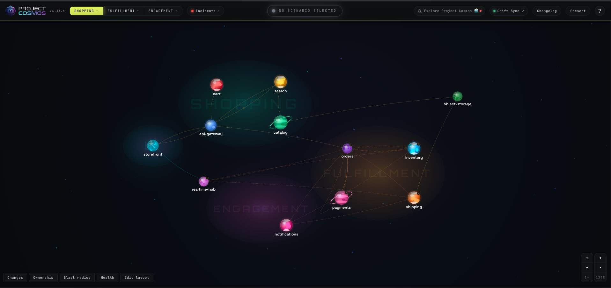

<p align="center">
  
</p>

<p align="center">
  <a href="https://github.com/orassayag/project-cosmos/actions/workflows/validate-on-pr.yml"></a>
  <a href="CONTRIBUTING.md"></a>
  <a href="https://project-cosmos-six.vercel.app/"></a>
  <a href="https://github.com/orassayag/project-cosmos/releases"></a>
  <a href="LICENSE"></a>
</p>

<p align="center">
  <a href="https://project-cosmos-six.vercel.app/">Live demo</a> -
  <a href="#quickstart">Quickstart</a> -
  <a href="#ask-the-agent-ai">AI agent</a> -
  <a href="#make-it-your-cosmos">Make it yours</a> -
  <a href="#drift-sync">Drift Sync</a> -
  <a href="CONTRIBUTING.md">Contributing</a>
</p>

<p align="center">
  <a href="https://project-cosmos-six.vercel.app/"></a>
</p>

## Project Cosmos is a living map of your architecture

Every service is a star. Kafka topics orbit between them. Real flows play as comets you can watch, pause, and inspect — payloads included. Ask the map a question in plain English and an AI agent answers from the map itself. And a nightly AI agent keeps the whole map honest against your actual code.

> Originally based on [Cosmos OS](https://github.com/ludeo-labs/cosmos-os) — see [Origin & credits](#origin--credits).

## Why

Every architecture diagram starts dying the moment it's born. The wiki page is from two reorgs ago, the Lucidchart link is stale, and the only reliable documentation is a senior engineer with a whiteboard. Project Cosmos takes a different bet:

1. **The server owns the map, in git; the client renders it.** Everything you see — services, topics, flows — is one set of plain TypeScript files under `server/src/cosmos/data/`, served at `GET /api/cosmos`. No database, no sync job to a diagramming SaaS: a data change is a commit. The client holds no domain data; it draws whatever the server returns, and the AI agent reads the same model.
2. **Flows are playable, not drawn.** A scenario is a real request traced hop-by-hop: URL, headers, payload, what got produced to which topic, what got written to which database. Press play and watch it fly.
3. **Honesty is automated.** A nightly agent diffs your repos against the map and opens one PR per team when reality moved. Forgetting to update the docs stops being an option.
4. **Questions get answered from the map, not from guesses.** The AI agent only knows what the map knows, and can only point at services and scenarios that really exist on it.

## What's in the box

### The map

- 🗺️ **The map** — an animated SVG cosmos of your services (planets), Kafka topics (orbitals), and protocol-colored connections (HTTP amber, WebSocket cyan, Kafka orange). Every service is a distinct world — terran, cratered, banded, icy, volcanic or ringed — derived deterministically from its id, over nebula fields with parallax panning.
- 🎬 **Scenario player** — named end-to-end flows play as comets along real curved paths, with a step panel showing the actual request/response payloads at every hop, and an on-map stepper to walk through them. Deep-linkable (`?domain=…&scenario=…&step=…`).
- 🚨 **Incident replay** — pick a past production incident from the **Incidents** list and press play. The map replays the exact path the failing request (or cascade) took, with the real (redacted) payloads captured at the time, a red comet, a banner so it never reads as live traffic, and a star explosion when the meteor hits the failing service. Deep-linkable (`?incident=…&step=…`).
- 🔎 **Quick search** — press `/` anywhere and start typing: services, topics and scenarios rank together in one palette, and picking a result warps the map straight to it.
- 📜 **Live activity log** — a running `LIVE · ACTIVITY` feed of every step as it fires during playback, so you can read the whole path at once instead of one step at a time.
- 🔍 **Service passports** — click any star: owner team, repo link, stack, databases, and why it exists.
- 🪐 **Service ecosystems** — umbrella services expand into a mini solar system of sub-services; packets re-route through the internals during playback.
- ✏️ **Layout edit mode** — hit `Edit layout` (or press `L`), drag stars and topics where you want them, then `Copy coords` and paste the values into the data files. Try it in the [live demo](https://project-cosmos-six.vercel.app/) — your rearrangement stays in your browser only.

### Insight views

- 🔦 **Blast radius** — click a service or topic and the map ranks everything that would break if you changed it, HIGH → MED → LOW. It walks the real dependency graph, which reverses direction for synchronous calls versus Kafka hand-offs, so the answer is genuine impact, not just "what's connected."
- 🌡️ **Service health heat map** — stars tint by commit age and open-PR backlog (fresh → warm → hot); click one for its on-call card: who's holding the pager, until when, and which Slack channel to escalate in.
- 👥 **Ownership view** — an ownership legend that isolates everything a team owns with one click, so a crowded galaxy collapses to just one team's surface.
- ✨ **What changed last night** — after a nightly run, the affected services and topics glow on the map in their change color; the overlay lists each finding with a link to the draft PR the pipeline raised. A footer status pill links straight to the latest run on GitHub Actions.
- 🗞️ **Architecture changelog** — the drift history as a browsable "added / changed / risk / removed" list; click an item to warp the map into that commit's context and jump to its PR or the affected node.

### AI

- 💬 **Ask the agent** — a multi-turn chat over the whole architecture, backed by a real LangChain + LangGraph agent. Run the project locally with a Claude or OpenAI key in `server/.env` and the bot in the bottom-right corner turns green; each answer streams in word by word, with a token count and suggested follow-up questions, and the agent can light up every service it mentions and start playing the matching scenario. No visitor ever types a key: on the live site the bot stays red and explains how to run the agent locally. See [Ask the agent (AI)](#ask-the-agent-ai).
- 🌙 **Drift Sync** — the nightly honesty robot. Diffs every tracked repo against a baseline SHA, filters noise with cheap regexes, asks an AI agent "does the map still tell the truth?", and opens one tidy PR per team with file:line evidence.
- 🤖 **Two Claude skills** — `/add-service` and `/add-scenario` teach [Claude Code](https://claude.com/claude-code) to interrogate your repos and grow the map for you: who do you call, what do you produce, to which topic, what database are you hiding.

### Presenting and sharing

- 📽️ **Presentation mode** — `P` strips the UI back to the bare map and fattens the comets so a scenario reads from the back of the room; the arrow keys and space still drive playback with the controls hidden.
- 🎥 **Self-playing demo tours** — open the site with `?demo=ai` or `?demo=all` and it tours itself. See [Demo tours](#demo-tours).
- 📱 **Mobile-first** — the whole app works on a phone. See [Mobile](#mobile).
- 🏷️ **Version badge** — the top bar shows the current version from the [version ledger](#versioning).

## Quickstart

Requires Node ≥ 22 and pnpm (`corepack enable` picks up the version pinned in `package.json`).

```bash
git clone https://github.com/orassayag/project-cosmos.git
cd project-cosmos
pnpm install
pnpm dev
```

Open http://localhost:5173 — you're looking at **AstroMart**, a fictional space-gear e-commerce platform that ships with the repo as demo data. Pick a domain, choose a scenario (start with *Place an order*), press play.

`pnpm dev` starts the client (Vite, `:5173`) and the API server (`:8787`) together, no account needed; Vite forwards `/api/*` to the server, and the map loads its data from `GET /api/cosmos`. The server is required — the client ships no map data of its own. Edit anything in `server/src/cosmos/data/` while it runs: the server restarts and the open map picks up the new data within about 2 seconds, no reload. Without AI keys the whole map works; the agent button in the bottom-right corner stays red and explains how to switch the agent on. To run the AI agent too, see [Run with AI locally](#run-with-ai-locally).

### Useful commands

Run from the repo root — it is a pnpm workspace root (`client/`, `server/`).

| Command | What it does |
|---|---|
| `pnpm dev` | Client on `:5173` + API server on `:8787` (Vite proxies `/api` to it) |
| `pnpm dev:client` | Client only (Vite) — the map shows its error screen, since nothing answers `/api/cosmos` |
| `pnpm dev:server` | API server only, on `:8787` (`tsx watch`, restarts on any server or data change) |
| `pnpm build` | Builds every workspace (client: `tsc -b && vite build`) — the gate for every change |
| `pnpm typecheck` | Type-checks every workspace, no emit |
| `pnpm lint` | ESLint over `client/`, `server/`, `drift-sync/`, `scripts/` |
| `pnpm test` | Vitest in the client and server workspaces, plus the `scripts/` tests (`pnpm test:scripts`) |
| `pnpm test:e2e` | Playwright: boots `pnpm dev`, loads the map through `/api/cosmos`, and drives the agent chat (desktop and phone, with a faked agent) and the `?demo=ai` tour in Chromium (first time: `pnpm exec playwright install chromium`; `BASE_URL` reuses an app that is already running) |
| `pnpm types:emit` | Copies the API response types (`server/src/cosmos/apiTypes.ts`) to `client/src/api/cosmos-api.ts` — run after editing them; CI fails on a stale copy |
| `pnpm validate` | Data sanity over `server/src/cosmos/data/` (`validateCosmos()`): ids resolve, `phaseId`s unique, spacing, palette, clusters, demo tours; `--source-check` also greps your cloned repos |
| `pnpm fixture:cosmos` | Rewrites the client test fixture `client/src/__tests__/fixtures/cosmos-response.json` from the real `/api/cosmos` route — run after a data change; `pnpm test` fails on a stale copy |
| `pnpm parity:screens` | Compares 16 map views against `docs/plans/baseline-screens/` (`--update` to rebaseline) |
| `pnpm cosmos:check` | Runs the server-owned-data migration checks (`--phase N` for the checks up to phase `N`) |
| `pnpm fresh` | Replaces AstroMart in `server/src/cosmos/data/` with a minimal 2-star starter cosmos |
| `pnpm record:demo ai\|all` | Records a demo tour to `recordings/demo-<mode>.webm` |
| `pnpm sync`, `sync:*` | Drift Sync entry points — see [`drift-sync/README.md`](drift-sync/README.md) |

### Run with AI locally

The AI agent runs only on the local dev server (`pnpm dev`, bound to `127.0.0.1`); a deployed site never enables it. Put a provider key in `server/.env` (or `.env.local` at the repo root) and start the app:

```bash
echo 'ANTHROPIC_API_KEY=<your key>' >> server/.env
pnpm dev
```

| Variable | Required | What it does |
|---|---|---|
| `ANTHROPIC_API_KEY` | One of these two | Runs the agent on Claude. |
| `OPENAI_API_KEY` | One of these two | Runs the agent on OpenAI. |
| `AI_GATEWAY_API_KEY` | No | Vercel AI Gateway key used by JEV to triage questions. Without it, triage falls back to a free local keyword check. |

Without a provider key the AI routes answer `503 AI_NOT_CONFIGURED`; anywhere other than the local dev server they answer `503 AI_NOT_LOCAL`. The rest of the map works either way.

### Driving it from the keyboard

Everything the map does is reachable without the mouse:

| Key | What it does |
|---|---|
| `/` | Quick search — jump to any service, topic or scenario |
| `Space` | Play / pause the current scenario |
| `←` `→` | Previous / next step |
| `P` | Presentation mode — hide the chrome for a talk |
| `A` | Open / close the agent (the chat when the bot is green, the setup window when it is red) |
| `B` | Blast radius |
| `H` | Service health heat map |
| `O` | Ownership view |
| `C` | What changed last night (only once a drift run has landed) |
| `L` | Layout edit mode |
| `+` `−` | Zoom in / out |
| `0` | Reset the zoom |
| `Esc` | Reset the galaxy — clears the scenario, filters, selection and URL |

Mouse equivalents: drag the background to pan, scroll to zoom around the cursor, click any star or topic to open its panel. On touch screens: drag to pan, pinch to zoom, tap to open.

## Ask the agent (AI)

The agent answers questions about the architecture — *"What happens when a payment fails?"*, *"Which team owns checkout?"*, *"Play the order flow"*. Open it with the bot button in the bottom-right corner (or press `A`) and ask in the chat. It is a conversation: follow-up questions keep the earlier turns.

- **On a phone** the chat is a bottom sheet with its own close button; the question box stays pinned at its bottom.
- **On desktop** it docks on the right. If a right-side panel (step panel, on-call card, changelog) opens while an answer is still coming in, the chat stays open and folds into a small tab only once the answer ends; the tab shows the latest line and a dot for an unread answer. Clicking the tab (or pressing `A`) reopens the chat and closes that panel — a playing scenario keeps playing. A service card opened from the chat sits on the left.
- Three dots show while the agent is thinking. **Stop** ends an answer early (the cut-off reply stays, marked as stopped) and **New chat** starts over. Closing the chat never cuts an answer short.
- An empty chat offers example questions; after each answer, up to three follow-up chips (*"Who owns …?"*, *"What breaks if … fails?"*, *"Play …"*) are built from the services and scenarios that answer touched.
- Questions are capped at 500 characters; a counter appears past 400 and Send is disabled at the limit.

### Connecting

The bot button's light shows whether the agent is available. The page asks `GET /api/ai/status` once on load:

- **Green** — the local dev server has a model key. Clicking the bot (or `A`) opens the chat.
- **Red** — clicking it opens a setup window whose first line says why:
  - on the live site (or anywhere but the local dev server): *"Live answers are only available when running the project locally."*
  - locally without a key: *"No AI key is set yet."*

  Then the numbered steps: copy `server/.env.example` to `server/.env`, set `ANTHROPIC_API_KEY` *or* `OPENAI_API_KEY` (optionally `AI_GATEWAY_API_KEY` for JEV), and run `pnpm dev`. Questions are billed to the AI account whose key you set.
- **Grey** — the status has not answered yet; clicking it shows the same setup window with the live-site wording.

The page never asks for, sends or stores a key. The server reads the keys from its own env, and only when the local dev script started it (bound to `127.0.0.1`); a deployed server never enables the agent. A provider error (for example a refused key) shows as a message in the chat, with a *Try again* button, and the bot stays green.

### How a question is answered

```
question → JEV triage (AI_GATEWAY_API_KEY; free keyword fallback)
   ├─ off-topic                        → one fixed redirect to the map, 0 model tokens
   ├─ "play X" with a confident target → plays the scenario directly, 0 tokens
   └─ everything else                  → LangGraph agent on the configured Claude / OpenAI key
                                           ├─ streams the answer (NDJSON)
                                           ├─ read tools  → get_service, get_steps (payloads), blast_radius,
                                           │                who_owns, on_call, drift (changelog)
                                           ├─ highlight_services → lights up every service it names
                                           ├─ play_scenario      → starts the matching flow
                                           └─ show_blast_radius, open_passport, show_health, show_ownership,
                                              open_changelog_entry → opens that view above the answer,
                                              which comes back when the view is closed
```

- **Follow-ups skip triage.** The server takes the chat as `{ messages }` (up to the last 20 messages, alternating user/assistant, ≤ 8,000 characters, newest question ≤ 500) and only triages a chat's first question; every later question goes straight to the agent with the history, so *"and who owns it?"* is never mistaken for off-topic. The client trims older turns to fit; the server rejects, never trims.
- **JEV** (`typesafe-ai/jev` on Vercel AI Gateway, zero data retention) decides whether the question is about the map, what the visitor wants, and which scenario they mean — with a 3-second budget. If it is slow, unconfigured or unavailable, a free local keyword check decides on-topic vs. off-topic instead. Triage never calls the configured model.
- **The agent** is a LangGraph `StateGraph` (agent ⇄ tools) over LangChain chat models — `claude-sonnet-5` or `gpt-6-sol` — with a compact digest of the map (services, topics, scenarios, steps, teams, one health/on-call line per service, the latest drift run) plus read tools for the rest — payloads, blast radius, ownership, on-call and drift history. Relative times ("past 24 hours") are measured from the data's `asOf` date, not the real clock. Its tools are exactly the 13 above (`AGENT_TOOL_NAMES` in `server/src/agent/graph.ts`): it can read the map and show things on it, never edit the layout, start a demo, or write any saved state. Its map-action tools accept only ids that exist on the map, so it can never point at an invented service. Answers are capped at ~150 words.
- **Errors are explained, not dumped**: out of credit, rate-limited, invalid key, or a general provider problem — never echoing any part of the key.

### Server API

The server (`server/`) is a [Hono](https://hono.dev) app served under `/api`:

| Route | What it does |
|---|---|
| `GET /api/cosmos` | The whole map as one JSON — `{ version, data, derived }` — with `ETag: "<version>"` (304 on a matching `If-None-Match`) and a CDN cache that lasts until the next deploy. Does not load the AI stack |
| `GET /api/ai/status` | `200 { connected: true, provider }` when the local dev server has a model key; otherwise `503 { errorCode: 'AI_NOT_LOCAL' }` (not the local dev server) or `503 { errorCode: 'AI_NOT_CONFIGURED' }` (local, no key). Never calls the provider |
| `POST /api/ai/ask` | Takes `{ messages: [{ role, content }] }` and streams `token` / `action` / `usage` / `error` / `done` events as NDJSON |

The agent reads the same view `GET /api/cosmos` serves (`getCosmosView()`), so its answers and the map can't disagree.

## Demo tours

Open the site with `?demo=ai` (≤60 s) or `?demo=all` (≤120 s) and it plays a scripted tour of itself; add `&speed=2` (up to 8) to fast-forward. Any click or key press stops it.

- **`demo=ai`** opens the Fulfillment domain, opens the (already green) agent chat, types a question and shows the answer lighting up the map, then taps the suggested follow-up ("Who owns shipping?") for a second answer.
- **`demo=all`** tours the whole app: the intro, domains, playing and stepping a scenario, replaying an incident, the ownership view, and the AI agent.

The tours drive the **real UI**: a human-like pointer glides along curved paths, overshoots and settles, and types with natural rhythm, dispatching the same pointer, mouse and keyboard events a person would. Only the AI connection and the answers are faked: during a tour the chat answers from the scripted turns in `demo.ts` (`aiTour.turns` — each with its question, answer, map actions and follow-up chips), so a tour never contacts a real AI service and the live site needs no AI key. `pnpm validate` checks that every turn's ids exist and that each reply's first chip asks the next turn's question. On phones the pointer is hidden and the tours open the menu drawer when they need it.

Record a tour to video (with the dev server running):

```bash
pnpm record:demo ai
pnpm record:demo all
```

The recorder uses Playwright and fails if the tour aborts or runs over its time limit. It targets `http://localhost:5173` unless `BASE_URL` is set.

## Mobile

The app is built mobile-first and verified on a ~390px-wide phone first, then on desktop.

- **Phone-class** means `max-width: 768px` **or** `max-height: 480px` (landscape phones); the `useViewport` hook mirrors this onto `<html data-viewport data-touch>` so CSS and JS agree.
- On phones the topbar collapses into a slide-over **drawer** (domain and incident pickers, changelog, presentation, help), and every floating panel docks as a **bottom sheet** clear of notches and home indicators.
- **One panel at a time** — panels never stack: a detail card (inspector, agent chat, health card) hides the context panels behind it.
- **Every panel has a close button** in its top-right corner on phones.
- Touch gestures: drag to pan, two-finger pinch to zoom.

## Make it your cosmos

The entire universe lives in `server/src/cosmos/data/` — plain, typed TypeScript the server serves at `GET /api/cosmos` (the client holds no domain data):

| Concept | What it is | Where |
|---|---|---|
| **Service** | A deployed process → a planet on the map | `services.ts` |
| **Topic** | A Kafka topic used as an edge → an orbital node | `topics.ts` |
| **Domain** | A group of related scenarios | `domains.ts` |
| **Scenario** | A named, playable end-to-end flow | `scenarios.ts` |
| **Step** | One hop: from → to, protocol, payload | `steps/*.ts` |
| **Team** | An owner, for the ownership view and passports | `owners.ts` |
| **Cluster** | A backdrop + nebula grouping services | `clusters.ts` |
| **Demo tours** | What `?demo=all` and `?demo=ai` show | `demo.ts` |
| **Incident** | A past production incident, frozen in time and replayable | `incidents/*.ts` |

**Start from the template (forks):** click **Use this template** on GitHub (or fork), then:

```bash
git clone https://github.com/<you>/<your-cosmos>.git
cd <your-cosmos>
pnpm install
pnpm fresh   # replaces AstroMart with a minimal 2-star starter cosmos
pnpm dev     # your galaxy, ready to grow
```

Then deploy both Vercel services (see [Deployment](#deployment)). The server is required: it is where the map lives, and the client only renders what `GET /api/cosmos` returns.

Known gap: after `pnpm fresh`, `pnpm dev`, `pnpm validate` and the client tests work, but the server type-check (part of `pnpm build`) and the server tests still assume AstroMart (its teams, services and the frozen parity fixtures). Delete or adapt those server tests in your fork before relying on `pnpm build` in CI.

Two ways to populate it:

**With Claude Code (recommended)** — the repo ships with two skills. Open the repo (plus your service repos) in a Claude Code workspace and say:

```
/add-service payments
/add-scenario show me what happens when a customer checks out
```

You can also install the skills into any environment as a plugin, no clone needed:

```
/plugin marketplace add orassayag/project-cosmos
/plugin install cosmos@project-cosmos
```

…then use `/cosmos:add-service` and `/cosmos:add-scenario` anywhere.

The skills make Claude read your actual source — call sites, producers, consumers, schemas — and write verified entries. No guessing allowed; the skill files are the guardrails.

**By hand** — copy any AstroMart entry, follow the shapes in `server/src/cosmos/apiTypes.ts`, and keep three invariants: unique ids, a service's `hex` equals `PALETTE[service.palette]` (`palette.ts`), and `phaseId`s are global and never reused. `pnpm build` type-checks everything, and `pnpm validate` is the data sanity gate — it checks that every `from`/`to`/`via`/`through` resolves to a real service or topic, that `phaseId`s are unique, that capsules keep their minimum spacing, and that palettes, clusters, topic groups and the demo tours point at real entries. Run `pnpm fixture:cosmos` after any data edit and commit the regenerated client test fixture with it. All of these run in CI on every PR (the **Validate** badge above), alongside `pnpm lint` and `pnpm test`.

Placing nodes is easiest visually: enter **Edit layout** mode, drag things into place, `Copy coords`, and paste the `x`/`y` lines back into `server/src/cosmos/data/services.ts` / `topics.ts`. Topics normally auto-arrange in a ring around their owning service — if a ring slot collides with a neighbor, set `pinned: true` on the topic and it fans out to your hand-placed coordinates instead.

To start clean, run `pnpm fresh`, then grow your own sky.

## Record a production incident

An incident is just a scenario frozen in time. Recordings live in `server/src/cosmos/data/incidents/` (one file per incident); the app discovers, lists, and plays them automatically — no AI, no database. Recording one takes 10–30 minutes for someone who already has the logs:

1. **Open the closest scenario** in `server/src/cosmos/data/steps/` (or start blank) and note the hops the failing request actually took.
2. **Copy the relevant steps** and replace the example payloads with the real ones from the logs — redact card/customer/token fields (`"[redacted]"`).
3. **Add the title, date, and a one- or two-sentence note** describing what went wrong.
4. **Give it a globally-unique `phaseId`** (incidents use `101+` so they never collide with scenarios) and set every step's `phase` to that same id.
5. **Save the file** under `server/src/cosmos/data/incidents/`, import it in `server/src/cosmos/data/incidents/index.ts`, and drop it into the `INCIDENTS` array. `pnpm build` type-checks it; the map and the AI agent both read it from the server.

Every step's `from` / `to` / `via` / `through` must match an existing `SERVICES[].id` or `TOPICS[].id` — incidents reuse the same map you already drew.

A complete, copyable example (trimmed):

```ts
// server/src/cosmos/data/incidents/checkout-timeout-2026-08-01.ts
import type { Incident } from '../../types.js';

export const CHECKOUT_TIMEOUT_2026_08_01: Incident = {
  incident: true,
  id: 'checkout-timeout-2026-08-01',
  domain: 'incidents',
  phaseId: 104,                       // globally unique, never reused
  status: 'ready',
  label: 'Checkout timeout',
  color: 'var(--svc-red)',
  date: '2026-08-01',
  time: '11:20 UTC',
  note: 'Orders backed up when payments stopped responding — captures queued and checkout requests timed out.',
  short: 'Payments stalls; checkout requests time out.',
  refs: [{ label: 'Post-mortem ticket', url: 'https://tickets.example.dev/INC-2400' }],
  steps: [
    { phase: 104, from: 'orders', to: 'payments', type: 'http',
      label: 'POST /v1/payments/capture', title: 'orders → payments: capture hangs',
      plain: 'orders called payments synchronously; payments never answered.',
      payload: `POST /v1/payments/capture

{ "orderId": "ord_A1B2...", "paymentMethodToken": "[redacted]" }

// no response for 30s — upstream timeout` },
    // …more hops…
  ],
};
```

Then register it:

```ts
// server/src/cosmos/data/incidents/index.ts
import { CHECKOUT_TIMEOUT_2026_08_01 } from './checkout-timeout-2026-08-01.js';
export const INCIDENTS: Incident[] = [
  CHECKOUT_TIMEOUT_2026_08_01,
  // …existing incidents… (the server lists them newest first)
];
```

The three incidents that ship with AstroMart (`server/src/cosmos/data/incidents/*.ts`) are working references — copy whichever is closest to your first real recording.

## Drift Sync

The map you can't trust is worthless — so Project Cosmos ships with its own lie detector. Every night:

```
clone tracked repos → diff vs baseline SHA → regex prefilter (~95% exit free)
   → AI agent reads the survivors → drift verdict with file:line evidence
   → applier edits the map, validates in-loop → one draft PR per team → Slack ping
```

Merging the PR bumps the baseline inside the same PR — merge means caught-up, no state cron needed. The applier may only write `server/src/cosmos/data/`; any other path is rejected. Full setup (GitHub PAT, Anthropic API key, optional Slack) in [`drift-sync/README.md`](drift-sync/README.md). It's off by default; enable it when you're ready.

## Project layout

```
client/                 Vite + React app (the map)
  src/api/              the /api/cosmos client, CosmosProvider, emitted API types
  src/map/              SVG map rendering, edges, planets, insight views
  src/components/       UI shell: intro, playback, step panel, agent button, agent chat, setup window
  src/demo/             self-playing demo tours
  src/hooks/            viewport, deep links, map view, AI connection
  src/overlays/         overlay manager (one panel at a time)
  src/styles/           tokens, app, components, responsive.css (loaded last)
server/                 Hono API: GET /api/cosmos and the AI agent (Vercel Function)
  src/cosmos/data/      the universe as typed data — most changes belong here
  src/cosmos/           schema, validateCosmos(), derived views, the /api/cosmos body
  src/agent/            JEV triage, routing, LangGraph agent, map-action tools
drift-sync/             the nightly honesty pipeline (its own README)
scripts/                fresh-start, demo recorder, version + README-reminder hooks
versions/               the version ledger, one file per year
pages-redirect/         the GitHub Pages redirect page to the Vercel app
skills/                 add-service, add-scenario as a plugin (.claude-plugin/)
.claude/skills/         add-service, add-scenario, update
docs/                   plans and working status
```

## Deployment

The app is one [Vercel](https://vercel.com) project using **Vercel Services** (`vercel.json`): `client/` serves the static app and `server/` serves `/api/*` as a function, both on one origin. Git auto-deploys are off — deploy deliberately with `vercel deploy`. Both services are required: the client loads the map from the server's `GET /api/cosmos`. No environment variables are needed: the AI agent is always off on a deployed site (`/api/ai/*` answers `503 AI_NOT_LOCAL`), so never put model keys in the Vercel project.

The old GitHub Pages address now serves only a redirect page (`pages-redirect/`) that forwards visitors and their deep links to Vercel.

## Testing and CI

- **Vitest** in both workspaces (`pnpm test`): the client suite covers the agent button, the agent chat, the setup window, the answer stream, the demo runner, human-like motion, and that every element a demo tour clicks really exists; the server suite covers the routes, the local-only agent config, the loopback dev server, JEV triage, the local fallback, routing, the agent graph, and provider-error mapping.
- **Data and screens**: the server suite pins the data to `server/src/__tests__/fixtures/baseline-full.json` (`cosmosParity.test.ts`), so a deliberate data change updates that fixture in the same PR; `pnpm test:e2e` (Playwright) loads the map through `/api/cosmos` and drives the agent chat and the `?demo=ai` tour end to end (the agent's replies are faked in the browser, so no key is needed), and `pnpm parity:screens` compares 16 map views with `docs/plans/baseline-screens/`.
- **CI** (`.github/workflows/validate-on-pr.yml`) runs lint, the client API-types freshness check (`pnpm types:emit` + `git diff`), build, the drift-sync type-check, `pnpm test`, and `pnpm validate` on every PR and push to `main`.

## Versioning

Every commit is auto-versioned by a local post-commit hook (`scripts/version-bump.sh`): the Conventional Commits type decides the bump (`feat` → minor, `!` / `BREAKING CHANGE` → major, anything else → patch), a plain-English row is added to `versions/<year>.md`, and the commit is tagged `vX.Y.Z`. The top bar shows the current version. A companion `commit-msg` hook (`scripts/readme-reminder.sh`) prints a non-blocking reminder to refresh `README.md` and the GitHub description when a `feat` or breaking commit does not stage the README. Install both hooks once per clone:

```bash
bash scripts/install-hooks.sh
```

With Claude Code, `/update` writes the version note, commits, and pushes in one step, and `/revert <x.y.z>` restores any recorded version. The ledger is generated — never edit `versions/*.md` by hand.

## Tech notes

- **Client**: Vite 8 + React 19 + TypeScript (strict), Framer Motion for panels. It holds no domain data: it fetches `GET /api/cosmos` once at startup (polling it every 2s in dev only) and renders the response. The response types are emitted from the server (`pnpm types:emit`).
- Comets glide on the **real rendered SVG paths** (GSAP MotionPath + `getPointAtLength()`), not approximations.
- The hyperspace intro is a plain `<canvas>` and one perspective formula — no 3D library.
- OKLCH color tokens, themeable (`cosmos`, `light`, `minimal`, `dark`).
- **Server**: Hono on Vercel Functions (Node). It owns the map: typed data in `server/src/cosmos/data/`, checked by Zod schemas and `validateCosmos()`, served with an `ETag` and CDN caching — no database. Zod-validated requests, structured logging that never records keys.
- **AI**: LangChain (`@langchain/anthropic`, `@langchain/openai`) + LangGraph for the agent; the AI SDK's evaluation API on Vercel AI Gateway for JEV triage; the Anthropic SDK for Drift Sync.

## Origin & credits

Project Cosmos is originally based on [Cosmos OS](https://github.com/ludeo-labs/cosmos-os), created by [Omer Sher](https://github.com/ludeo-labs) at [Ludeo](https://ludeo.com) and released under the MIT License. The original copyright notice is preserved in [`LICENSE`](LICENSE).

Cosmos OS began as an internal tool at Ludeo, built to answer "wait, what happens after the client sends this?" without archaeology. The full story: [Your architecture diagram is already wrong — so I built a galaxy instead](https://medium.com/@omersher_79552/your-architecture-diagram-is-already-wrong-so-i-built-a-galaxy-instead-d4cf6c62ade9).

On top of the original map, this project adds:

- **A real AI agent** — a Hono server on Vercel running a LangChain + LangGraph agent that
  answers questions about the architecture with the visitor's own Claude or OpenAI key, streams
  the answer, and lights up services or plays scenarios on the map. Questions are triaged first
  by **JEV** (a classification model on Vercel AI Gateway) so off-topic questions never cost the
  visitor a token.
- **Architecture insight views** — incident replay, blast-radius analysis, a service health
  heat map with on-call cards, an ownership view, a "what changed last night" drift overlay, and
  a browsable architecture changelog.
- **A mobile-first, responsive UI** — a phone drawer, bottom-sheet panels, pinch-zoom, and a
  strict one-panel-at-a-time policy.
- **Self-playing demo tours** (`?demo=ai`, `?demo=all`) that drive the real UI with a human-like
  pointer, plus a Playwright recorder.
- **Presentation mode, an on-map step stepper, quick search, a live activity log**, and a richer
  visual layer (planet morphology, nebula fields, parallax panning, star explosions).
- **A client/server pnpm-workspace layout, Vitest suites in both workspaces, and a local
  version ledger** with a version badge in the top bar.

## Contributing

PRs welcome — [CONTRIBUTING.md](CONTRIBUTING.md) has the dev setup and the three invariants that bite. Security reports: see [SECURITY.md](SECURITY.md).

## License

[MIT](LICENSE) © Ludeo, © Or Assayag
