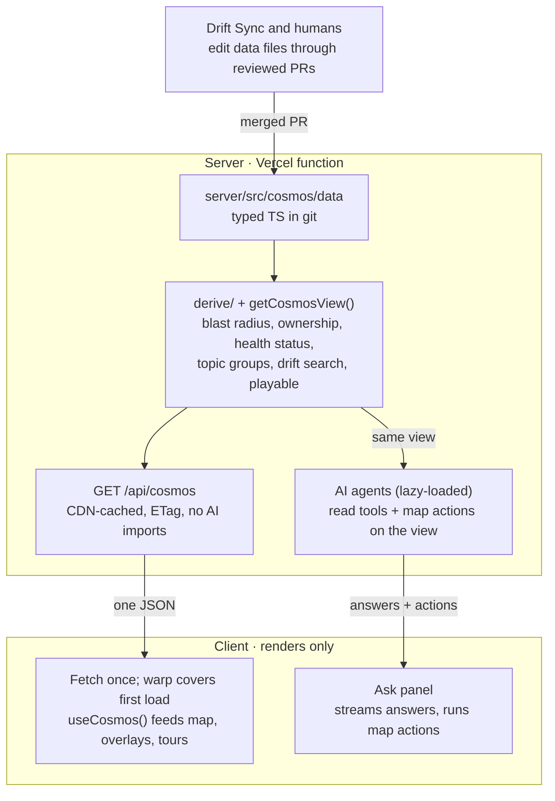

# Server-Owned Data Migration — Plan

## Summary

Project Cosmos today keeps its whole universe (services, topics, scenarios, steps, incidents, owners, drift, health, brand) as typed data in `client/src/scenarios/` and `client/src/incidents/`, and computes system facts (blast radius, ownership, health status, topic groups) in the browser. The AI agents read only `server/src/generated/cosmos-map.json`, a partial snapshot with no payloads, drift, health, on-call or blast radius — so the agent and the UI can disagree, and the `?demo=ai` tour has to fake its answer.

This plan makes the server the single owner of the data and of every derived fact. Data moves to typed TS files under `server/src/cosmos/data/` (still in git, still edited by reviewed PRs and Drift Sync). Pure derive functions compute a frozen view once; one endpoint, `GET /api/cosmos`, returns data plus derived values, CDN-cached with an ETag and isolated from the AI stack. The agents read the same view and gain read tools and map actions. The client fetches once (covered by the hyperspace warp), renders from a React context, and keeps only geometry, animation and layout logic. The migration runs in 14 ordered phases (0–13), each gated by parity against a baseline captured in Phase 0, so the AstroMart map looks and behaves identically throughout.

## Scope

**In scope**

- Phase 0 baseline fixtures (data + derived) and screenshots, as the parity oracle.
- Moving every client data module to `server/src/cosmos/data/` with Zod validation and a complete `validateCosmos()`.
- Replacing hardcoded AstroMart ids in client rendering code with data fields (`clusters`, `nebula`, `ecosystem`, `role`, `groupServiceId`, `palette`).
- Server-side derive modules and `getCosmosView()`.
- `GET /api/cosmos` (ETag, 304, CDN cache headers, no AI imports) and lazy-loading of the AI stack.
- A single-file response type copied to the client, guarded by CI.
- Agents switched to the full view, with read tools, new map actions and a mocked-LLM eval suite.
- Client data layer, loading gate, timeout/error/Retry, and a no-account local dev loop (`npm run dev` runs client + plain Node server + `/api` proxy) from Phase 7 onward.
- Migrating every client feature to `useCosmos()`; moving demo-tour ids and scripted answer into server data.
- Retargeting Drift Sync, validation, `npm run fresh`, skills and `record-demo.mjs` to the new paths.
- Deleting the client data copies, the snapshot and its tooling.
- Docs, dev-only live data reload, fork quickstart, preview + production verification including a deployed-`version` check.
- **A1** — one Playwright end-to-end test of the real loading path, in CI.
- **A2** — `npm run parity:screens`, one command for the screenshot comparison.
- **A3** — `npm run cosmos:check`, one pass/fail migration progress report.

**Out of scope (non-goals)**

- Any database; any write/import/PATCH/DELETE endpoint; auth.
- `cosmosId` or multi-tenancy.
- A shared `packages/` workspace between client and server.
- Visual redesign or new product features beyond the Phase 6 agent tools and map actions.
- Real producers for drift and health data (recorded as follow-up only).
- Splitting `/api/cosmos` into its own Vercel function (only if cold starts stay slow — stop and ask).

## Issue Resolutions

| ID | Title | Detected by | Description | Resolution | Notes |
|----|-------|-------------|-------------|------------|-------|
| I1 | Local development stops working from Phase 7 until Phase 12 | Claude, gpt | Phase 7 makes the app wait for `/api/cosmos` before it draws the map. Locally, nothing answers that request: `npm run dev` starts only Vite (the client dev server), and `client/vite.config.ts` has no `/api` proxy (a rule that forwards API calls to the server). The task "reuse the existing `/api` proxy" points at something that does not exist. Today the AI features run locally only through `vercel dev`, as the README says. So from Phase 7 on, every local run shows the warp for 10 seconds and then the error screen. That blocks the Phase 8 screenshot checks, `npm run record:demo` and the demo-tour timing runs. The proper dev setup only arrives in Phase 12, which also says to "reuse how the server runs today". Today that means `vercel dev`, which needs `vercel link` and a login. That breaks the Phase 12 promise that a fresh fork clone reaches a running map with only `npm run dev`. <br><br> **Before Fix:** Halfway through the migration, opening the app on your own computer shows a loading animation and then an error. You can't check your work or record the demo, and anyone who forks the project needs a Vercel account just to see the map. <br><br> **After Fix:** One command starts the whole app on your computer at every phase, with no account needed, so every check in the plan can actually be run. | Fixed | Dev loop (Node runner on :8787 via `@hono/node-server` + `tsx watch`, Vite `/api` proxy, `concurrently`) moved into Phase 7, first task. Phase 12 keeps only live-data polling and docs. |
| I2 | Retry repeats the failed request instead of trying again | gpt, z.ai | Phase 7 says `startCosmosFetch()` keeps the request it started and returns that same request on every call. If the first attempt fails or hits the 10-second timeout, the stored request is a failure. Retry then calls `startCosmosFetch()` and gets the same failure back at once. Example: the API is down when the page opens, the error screen appears, the API comes back, and the user presses Retry. The error stays, so the Phase 7 acceptance check ("Retry recovers") cannot pass. <br><br> **Before Fix:** Once loading fails, the Retry button does nothing, and the user has to reload the whole page. <br><br> **After Fix:** Pressing Retry really tries again, and the map opens as soon as the server is back. | Fixed | `cosmosClient.ts` clears its cached promise on rejection and aborts via `AbortController` on timeout; test "fails then succeeds after Retry". |
| I3 | The type-generation step will not produce the single file the plan expects | gpt | Phase 5 runs `tsc --declaration --emitDeclarationOnly` on `apiTypes.ts`. That file is allowed to import `types.ts`. The TypeScript compiler writes one declaration file (`.d.ts`, a types-only copy of a code file) for every source file it reads, and it names each output after its source. So the command writes `apiTypes.d.ts` and `types.d.ts`, not one `client/src/api/cosmos-api.d.ts`. The `--outFile` option can't combine them for this project's module setting (NodeNext). The CI check (`git diff --exit-code client/src/api/`) would then guard files the client does not import. <br><br> **Before Fix:** The step that should keep the browser and the server agreeing on the data's shape writes the wrong files. The safety check then watches files nobody uses. <br><br> **After Fix:** The browser gets one exact copy of the server's data description, and CI fails the moment the two stop matching. | Fixed | `apiTypes.ts` is self-contained (no imports); `types.ts` re-exports it; `schema.ts` uses `satisfies z.ZodType<CosmosResponse>`; `types:emit` copies the file with a header, no compiler. |
| I4 | Phase 2 has to change existing values, which the plan forbids | Claude (adversarial) | Phase 2 replaces each service's `color: 'var(--svc-cyan)'` with a `palette: 'cyan'` key. It also replaces topic grouping by name prefix with an explicit `groupServiceId`. Both remove or change values that `baseline-full.json` records. But Phase 2 says "existing values must not change", and the stop list says to stop whenever "a data value must change to make a test pass". If the executing agent follows the plan exactly, it either stops at Phase 2 or keeps `color` forever, and then the coupling to `tokens.css` the phase set out to remove stays. <br><br> **Before Fix:** The plan's own rules contradict each other at Phase 2. The migration either stalls or quietly leaves the old color setup in place. <br><br> **After Fix:** Phase 2 can finish, and tests prove the colors and groupings still look exactly the same. | Fixed | Phase 2 names exactly two allowed fixture changes (`color`→`palette`, prefix rule→`groupServiceId`), each proven by an equivalence test; the stop rule carves out these two. |
| I5 | Pausing Drift Sync by editing the workflow file does not pause it | Claude, z.ai | Phase 1 pauses Drift Sync by disabling the cron in `cosmos-sync.yml`. Scheduled GitHub workflows run only from the copy of that file on the default branch, so editing it on a phase branch changes nothing until that branch merges. The workflow is actually switched on by the repository variable `DRIFT_SYNC_ENABLED`, not by the cron line. Drift Sync PRs that are already open would also still edit `client/src/scenarios/` if they merge mid-migration. Example: a PR opened the night before Phase 1 merges during Phase 5. Now the client copy has a change the server copy lacks, and the parity test blocks every later phase. <br><br> **Before Fix:** The nightly bot can keep editing the old files while you move them, and the two copies of the data quietly stop matching. <br><br> **After Fix:** The bot is really switched off for the whole move, and nothing it opened earlier can land halfway through. | Fixed | Verified: `cosmos-sync.yml:72` gates on `vars.DRIFT_SYNC_ENABLED == 'true'`. Pause via `gh variable set`, drain open Drift Sync PRs, re-enable in Phase 10. |
| I6 | Checking a single preview cannot prove that a deploy publishes new data | grok, preplexity | Phase 4 sets a one-year CDN cache (`s-maxage=31536000`). It relies on "each deployment has its own CDN cache" and verifies that on one preview. One preview only proves that the second request is a cache hit. It can't show that the next production deploy serves new data instead of last year's cached copy. Phase 13 also checks only `x-vercel-cache: HIT` on production, and that check stays green even when the data is stale. <br><br> **Before Fix:** A release could keep showing the old map to visitors, and every check would still pass. <br><br> **After Fix:** Each release proves that the live site shows the data that was just deployed. | Fixed | Build prints the computed `version`; Phase 13 compares production `/api/cosmos` `version` against it; mismatch is a stop condition. |
| I7 | No stated action when the response is over its size target | z.ai | Phase 4 says to record the compressed size of `/api/cosmos` and gives a 100 KB target. It does not say what to do if the response is bigger. Every other target in the plan has a "stop and ask" rule, so the executing agent has to guess here. <br><br> **Before Fix:** If the data comes out too big, whoever is doing the work has to decide alone whether that's acceptable. <br><br> **After Fix:** A response that's too big pauses the work, and the owner decides. | Fixed | Added to the stop list. |

## Design

### Ground rules for the executing agent

- Execute phases in order, one phase per branch or commit series; do not start a phase until the previous phase's acceptance passes. The plan targets v1.33.3+; if paths have moved, re-run the Phase 0 inventory and update paths first.
- `CLAUDE.md` wins on process: Conventional Commits, `scripts/version-note.sh write` before every commit, README check on every commit.
- Gates before every commit: `npm run build`, `npm run typecheck`, `npm run lint`, `npm test`. Never run `tsc` without `--noEmit`/`-b`.
- Repo invariants hold throughout: unique global `phaseId`; step `from`/`to`/`via`/`through` resolve; world 2400×1400; capsules ≥150px apart; AstroMart stays fictional.
- UI invariants hold throughout: mobile-first, one panel at a time on phones, top-right close control on every floating panel.
- Demo tours keep working after every phase: `?demo=all` ≤120s, `?demo=ai` ≤60s (`client/src/demo/__tests__/scripts.test.ts` or its current location guards them).
- The AstroMart map must look and behave identically after every phase.
- Ambiguity → smaller change, recorded in `docs/plans/server-owned-data-decisions.md`. Stop conditions are listed at the end.

### Target architecture



The only way data changes is a reviewed PR to the files. The client never computes a system fact.

### Phase 0 — Baseline and parity oracle

No product code changes.

- Run `npm run build`, `npm test`, `npm run validate`, `npm run lint` on `main`; record results in the decisions log. Red `main` → stop.
- **Pause Drift Sync (I5).** Scheduled workflows run from the default branch and `cosmos-sync.yml` is gated by `vars.DRIFT_SYNC_ENABLED`, so pause at the repository level:
  ```
  gh variable set DRIFT_SYNC_ENABLED --body false
  gh pr list --search "head:drift-sync" --state open
  ```
  Merge or close every open Drift Sync PR before capturing the baseline (so the baseline includes or excludes each one deliberately). Record the variable change and each PR's disposition in the decisions log. *Verification:* `gh variable get DRIFT_SYNC_ENABLED` prints `false`; no open Drift Sync PRs. No automated test — this is repository configuration.
- `scripts/dump-baseline.ts` (run with `tsx`) writes `server/src/__tests__/fixtures/baseline-full.json`: `SERVICES` (with `x`, `y`, `width`, `height`, `color`, `hex`, `subServices`), `TOPICS`, `SCENARIOS`, all steps with payloads, `INCIDENTS` with steps, `DOMAINS`, `TEAM_OWNERS`, `FALLBACK_OWNER`, `DRIFT_ENTRIES`, `LATEST_DRIFT_*`, `SERVICE_HEALTH`, `HEALTH_AS_OF`, `BRAND`; plus derived values: `DEPENDENTS_OF`, `TOPIC_GROUPS`, `CONNECTED_NODE_IDS`, the `edge-builder.ts` edge list, `groupServicesByTeam()` output, health status per service.
- Copy `server/src/generated/cosmos-map.json` to `server/src/__tests__/fixtures/baseline-cosmos-map.json`.
- **Screenshot baseline via `npm run parity:screens` (A2).** Build `scripts/parity-screens.mjs`, reusing the Playwright launch/viewport setup from `scripts/record-demo.mjs`. One declarative list of views: default map, each scenario mid-play, each incident replay, blast radius on `payments`, health view, ownership view, drift overlay, changelog open, `realtime-hub` expanded, and the mobile viewport (390px) of the default map. Two modes:
  - `npm run parity:screens -- --update` writes `docs/plans/baseline-screens/<view>.png`.
  - `npm run parity:screens` retakes every view and diffs with `pixelmatch` (dev dependency), printing per-view diff pixel counts and writing `<view>.diff.png` to a gitignored `parity-out/`; exits non-zero if any view exceeds a threshold of 0.1% differing pixels (animations are paused / time is frozen via the same hooks the demo recorder uses, so the threshold only absorbs anti-aliasing).
  Scenario/incident views are driven through the real UI (deep links or clicks), not by setting state. *Verification:* run `--update`, then run without it twice; both runs report 0 views over threshold (proves determinism). Deliberately nudge one capsule `x` locally → the command fails naming that view; revert.
- Record production bundle size and first-map-paint time on `vite preview`.
- Create `docs/plans/server-owned-data-decisions.md` with known issues: `validate.ts` lacks `phaseId` uniqueness, spacing, color-token and incident-step checks despite `CLAUDE.md`; `client/src/scenarios/steps/core.ts` is an unused `npm run fresh` leftover; `drift.ts`/`health.ts` are hand-written fixtures.
- **Progress report scaffold (A3).** Add `scripts/cosmos-check.ts` (run with `tsx`), wired as `npm run cosmos:check`. It runs a table of named checks, each a `git grep` (or file-existence test) with an expected result, and prints `✅/❌ <check> — <offending files>`; exits non-zero if any *active* check fails. Each check carries the phase that activates it; `--phase <n>` (default: all) limits to checks whose phase ≤ n. Initial checks (later phases fill in their own entries as listed below):
  - `phase 0`: baseline fixtures and screenshots exist; decisions log exists.
  *Test:* `scripts/__tests__/cosmosCheck.test.ts` runs the check runner against a temp git repo fixture with one passing and one failing grep check — protects the pass/fail exit code and file listing. Unit layer.

**Acceptance:** fixtures, screenshots and decisions log committed; `npm run parity:screens` green; `npm run cosmos:check -- --phase 0` green.

### Phase 1 — Move the data into the server

Layout:

```
server/src/cosmos/
  apiTypes.ts         # self-contained response + entity types (Phase 5 finalizes)
  types.ts            # re-exports apiTypes.ts; server-only types
  schema.ts           # Zod schemas, each `satisfies z.ZodType<...>`
  data/
    brand.ts domains.ts services.ts topics.ts scenarios.ts
    owners.ts drift.ts health.ts
    steps/ shopping.ts fulfillment.ts engagement.ts
    incidents/ payment-cascade-*.ts inventory-oversell-*.ts hub-silence-*.ts
  validate.ts         # validateCosmos()
  index.ts            # getCosmosData(): one frozen object
```

- Copy each client data module into `data/`, server ESM style (`.js` suffixes, as in `server/src/app.ts`). Nothing under `server/` imports from `client/` or `drift-sync/`.
- Data only; leave `resolveOwner`, `groupServicesByTeam`, `driftEntryMatches`, PR/commit URL builders, `stepsForScenario` and health helpers for Phase 3. Do not copy `steps/core.ts`. Keep `color` unchanged for now.
- Entity types are written directly in `apiTypes.ts` with **no imports** (see Phase 5/I3), and `types.ts` re-exports them — so there is one definition from the start.
- `schema.ts`: Zod schemas checked against the types with `satisfies z.ZodType<T>`. `validate.ts` ports the reference checks from `drift-sync/scripts/validate.ts` and adds: unique `phaseId`, capsules ≥150px apart, incident steps resolve, step `from`/`to`/`via`/`through` resolve to a service, sub-service or topic.
- *Tests:* `server/src/__tests__/cosmosSchema.test.ts` — `getCosmosData()` parses; protects the data shape. `server/src/__tests__/validateCosmos.test.ts` — one case per rule, each with a deliberately broken clone (bad id, duplicate `phaseId`, capsules 100px apart, dangling incident step) asserting a named error; protects every invariant. Unit layer.
- *Parity:* `server/src/__tests__/cosmosParity.test.ts` deep-equals server data against `baseline-full.json`; a client-side twin (`client/src/__tests__/cosmosParity.test.ts`) deep-equals the client copy against the same fixture — so the two copies cannot drift. Temporary; the client half is deleted in Phase 11.
- A3 check added: `phase 1`: nothing under `server/` imports `client/` or `drift-sync/`.

**Acceptance:** `getCosmosData()` matches the baseline; validation catches each deliberately broken case; client unchanged; build green.

### Phase 2 — Move hardcoded domain knowledge into data

Find every case:

```
grep -rEn "storefront|api-gateway|'cart'|'search'|catalog|inventory|'orders'|payments|shipping|notifications|object-storage|realtime-hub|hub-|orders\.|payments\.|shopping\.|fulfillment\.|engagement\.|AstroMart" client/src --include=*.ts --include=*.tsx | grep -v __tests__ | grep -v 'client/src/scenarios/\|client/src/incidents/'
```

| Hardcoded today | Where | New data |
| --- | --- | --- |
| Cluster membership lists | `ShoppingCluster.tsx`, `UICluster.tsx`, `EngagementCluster.tsx`, fourth `*Cluster.tsx` | `clusters: Cluster[]` with `id`, `label`, `serviceIds`, plus hardcoded geometry/styling |
| Nebula anchor ids and colors | `NebulaField.tsx` | `nebula` on each `Cluster` (anchor ids, palette key) |
| `realtime-hub` ecosystem (`hub-ingest`, `hub-presence`, `hub-push`, `hub-broadcasts` internal edges) | `Map.tsx`, `edge-resolver.ts` | `ecosystem` on `Service`: `expandable`, `internalEdges` |
| `storefront` and other special cases | `edge-resolver.ts`, `Map.tsx` | A field named after the behavior (e.g. `role: 'entry'`) |
| Topic grouping by name prefix, alias `hub`→`realtime-hub` | `topic-groups.ts` | Explicit `groupServiceId` on each `Topic`; prefix rule and alias deleted |
| `color: var(--svc-cyan)` coupling to `tokens.css` | `services.ts`, `tokens.css` | `palette: 'cyan' \| …`; keep `hex`. Validation rejects unknown keys |

- Add types/schemas/values on the server; make the identical change in the client copy so both parity tests keep passing.
- Refactor each component to read the field. The client maps `palette` → `var(--svc-<key>)` itself; `tokens.css` stays client-owned.
- **Allowed fixture changes (I4).** Regenerate `baseline-full.json` with exactly these changes and no others: (1) new fields added (`clusters`, `nebula`, `ecosystem`, `role`, `groupServiceId`, `palette`); (2) `color` removed from services, replaced by `palette`; (3) the prefix-derived `TOPIC_GROUPS` input replaced by explicit `groupServiceId`. Keep the pre-Phase-2 fixture as `baseline-full.phase0.json` for the equivalence tests. Review the fixture diff; any other changed value is a stop condition.
- *Equivalence tests (I4):* `server/src/__tests__/phase2Equivalence.test.ts` — for every service, `` `var(--svc-${service.palette})` `` equals `phase0.SERVICES[id].color`, and `palette`'s hex matches the old `hex`; topic groups built from `groupServiceId` deep-equal `phase0.TOPIC_GROUPS`. Protects identical colors and grouping. Unit layer. Mirror the color check in the client parity twin.
- *Component test:* `client/src/map/__tests__/clusters.test.tsx` renders a cluster from fixture data with a renamed member id and asserts the member renders — protects the "rename needs no client code" boundary. Component layer.
- A3 check added: `phase 2`: the grep above returns only data files, tests and `client/src/demo/` (until Phase 9).
- `npm run parity:screens` green.

**Acceptance:** screenshots match baseline; equivalence tests pass; `npm run cosmos:check -- --phase 2` green.

### Phase 3 — Move derived logic to the server

Split rule: a fact about the system is server logic; geometry, paths, animation and layout overrides are client logic.

| `server/src/cosmos/derive/` | Ported from | Exposes |
| --- | --- | --- |
| `graph.ts` | `server/scripts/snapshot-map.ts`, logical part of `client/src/map/edge-builder.ts` | logical edges; `calls`/`publishes`/`consumes` per service; `connectedNodeIds` |
| `blastRadius.ts` | `client/src/map/blast-radius.ts` | `dependentsOf(nodeId)`, full map |
| `ownership.ts` | `client/src/scenarios/owners.ts` | `resolveOwner`, `groupServicesByTeam`, `ownerLabel` |
| `health.ts` | `client/src/scenarios/health.ts` helpers | status and on-call per service |
| `topicGroups.ts` | `client/src/map/topic-groups.ts` | groups from `groupServiceId` |
| `drift.ts` | `client/src/scenarios/drift.ts` helpers | latest entry, `searchDrift(query)`, prepared search text per entry, PR/commit URLs |
| `playable.ts` | `client/src/scenarios/data.ts`, `runner.ts` lookups | scenarios + incidents as one playable list; `stepsFor(id)` |

- `server/src/cosmos/view.ts`: `getCosmosView()` = data + all derived values, computed once, frozen, memoized. Pure functions only; no `client/` imports; no module-load side effects besides the memo.
- Port the existing client unit tests for these helpers to `server/src/cosmos/derive/__tests__/`. Extend `cosmosParity.test.ts`: every derived value equals the derived section of `baseline-full.json` — protects agent/UI agreement. Unit layer. Client copies stay until Phase 8.

**Acceptance:** derived parity passes for every node, team, service; existing client tests unchanged and green.

### Phase 4 — The cosmos API route

Response:

```
{
  "version": "<sha256 of serialized view, first 16 hex>",
  "data":    { brand, domains, clusters, services, topics, scenarios, incidents, owners, drift, health, demo },
  "derived": { edges, connectedNodeIds, blastRadius, ownership, topicGroups, healthStatus, latestDrift, driftSearchText, playable }
}
```

- Read `server/src/app.ts` first; match its `/api` prefixing, `notFound`, `onError`. Add the route beside `/ai/*`. It imports only `cosmos/view.ts`.
- Compute `version` and the serialized body once per process. Export `getCosmosVersion()` from `view.ts` for the build log (I6).
- `ETag: "<version>"`; 304 on matching `If-None-Match`. `Cache-Control: public, max-age=60, s-maxage=31536000, stale-while-revalidate=86400`. Verify on a preview that the second request is `x-vercel-cache: HIT`, and that a second preview built from a data change serves the new `version` (record both).
- **Build prints the version (I6).** Add `server/scripts/print-cosmos-version.ts` and call it from the server build script so every Vercel build log contains `COSMOS_VERSION=<version>`. Phase 13 compares against it.
- **Isolate the AI stack.** Move `import { answerQuestion } from './agent/askAnswer.js'` and every import that pulls LangChain, LangGraph or provider SDKs into `await import()` inside the `/ai/*` handlers.
- *Tests* in `server/src/__tests__/cosmosRoute.test.ts` via `app.request()`: 200 with full shape that parses with the Zod schema; 304 with matching ETag; exact `Cache-Control`/`ETag` headers — protects the HTTP contract the client and CDN depend on. `server/src/__tests__/cosmosIsolation.test.ts`: import `app.ts` with agent modules mocked to throw on load; `GET /api/cosmos` still 200 — protects "map loads when AI is broken". Unit/integration-in-process layer.
- Record gzip size in the decisions log. Over 100 KB is a stop condition (I7).
- Slow cold starts on preview after lazy imports → stop and ask before splitting the function.

**Acceptance:** tests pass; preview shows CDN HIT on the second request; broken agent import does not break the route; gzip ≤100 KB.

### Phase 5 — API contract and client types

The server owns the response type; the client receives a byte-for-byte copy of one self-contained file (I3). This copies shape, never data, so it respects the no-shared-package rule and avoids pulling Zod/Hono types into the client build.

- `server/src/cosmos/apiTypes.ts` contains `CosmosResponse` and every type it references, with **no imports** and no runtime code. `types.ts` re-exports from it. `schema.ts` declares `CosmosResponseSchema satisfies z.ZodType<CosmosResponse>`, so a type/schema mismatch is a compile error.
- `server/scripts/emit-client-types.ts`, wired as root `npm run types:emit`, reads `apiTypes.ts`, fails if it contains any `import`/`export … from` line, prepends `// GENERATED from server/src/cosmos/apiTypes.ts by npm run types:emit — do not edit.` and writes `client/src/api/cosmos-api.ts`. No `tsc` involved.
- CI step in `.github/workflows/validate-on-pr.yml`: `npm run types:emit` then `git diff --exit-code client/src/api/cosmos-api.ts`.
- *Tests:* `server/scripts/__tests__/emitClientTypes.test.ts` — output equals header + source; an input with an import line is rejected (protects the single-file invariant). The `satisfies` in `schema.ts` is enforced by `npm run typecheck`. Unit layer.
- Client runtime guard in the fetch layer: `version` is a string and every top-level `data`/`derived` key exists. Full validation stays server-side.

**Acceptance:** editing a field in `apiTypes.ts` without re-running `types:emit` fails CI; client typechecks against `cosmos-api.ts`.

### Phase 6 — Agents read the full model

Reading the data:
- Replace the `cosmos-map.json` import in `server/src/app.ts` and every agent module (`context.ts`, `classify.ts`, `localRelevance.ts`, `mapActionTools.ts`, `graph.ts`) with `getCosmosView()`.
- Digest stays small: add a short latest-drift summary and one health/on-call line per service; no payloads.
- Measure digest tokens before/after; record both. Growth >50% → trim; if trimming would remove information → stop and ask.
- Add `asOf` (latest drift/health date) to the data; the system prompt measures relative times from `asOf`.

Read tools (LangGraph, pure over the view): `get_service(id)`, `get_steps(playableId)`, `blast_radius(nodeId)` (same result as the `B` overlay), `who_owns(id)`, `on_call(serviceId)`, `drift(query?, since?)`.

Map actions (`mapActionTools.ts`, ids validated against the view): keep `highlight_services`, `play_scenario`; add `show_blast_radius(nodeId)`, `open_passport(nodeId)`, `show_health()`, `show_ownership()`, `open_changelog_entry(entryId)`. First confirm the current client ignores unknown actions safely — add `client/src/__tests__/askUnknownAction.test.ts` asserting an unknown action is a no-op (protects the gap until Phase 8). Component layer.

Evaluation — `server/src/__tests__/agentEval.test.ts`, mocked LLM as existing tests do, asserting tool calls and returned ids:
- "What changed in the Fulfillment Galaxy over the past 24 hours?" → `drift`, names `shipping.dispatched` and `giftWrap` entries.
- "What breaks if payments goes down?" → exactly `blastRadius['payments']`.
- "Who is on call for payments?" → matches health data.
- "What does the checkout request body look like?" → the step payload.
Existing classifier and relevance tests pass unchanged.

**Acceptance:** four eval questions pass; existing agent tests pass; no `cosmos-map.json` importer in `server/src/` except the parity test. A3 check added: `phase 6`: that grep.

### Phase 7 — Local dev loop, client data layer and loading

**Dev loop first (I1)** — no Vercel account required at any later phase:
- `server/scripts/dev-server.ts` serves the existing Hono `app` with `@hono/node-server` on port 8787. Root script `dev:server`: `tsx watch server/scripts/dev-server.ts` (add `@hono/node-server`, `tsx` if missing, and `concurrently` as root dev dependencies; check each for Node-version compatibility).
- `client/vite.config.ts`: change `server: { port: 5173 }` to `server: { port: 5173, proxy: { '/api': 'http://localhost:8787' } }`.
- Root `npm run dev`: `concurrently -n client,server "npm run dev --workspace client" "npm run dev:server"`. Keep `dev:client` as the client-only escape hatch.
- AI routes keep working under this runner given the same env vars `vercel dev` would supply; document required vars in the README's dev section (the map itself needs none).
- *Verification:* `scripts/__tests__/devLoop.test.mjs` is not worth its flakiness; instead A1's E2E test (below) boots this exact `npm run dev` setup in CI — that is the automated proof. Manual check: fresh shell, `npm run dev`, map loads at `:5173`, `curl -s localhost:5173/api/cosmos | head -c 80` returns JSON.

**Client data layer:**
- `client/src/api/cosmosClient.ts`: `startCosmosFetch()` returns a cached promise. **Retry-safe (I2):** each attempt creates an `AbortController`; a 10s timer calls `controller.abort()`; the promise is stored as `fetchCosmos(controller.signal).then(guard).catch((error) => { cachedPromise = undefined; throw error; })`, so a failed or timed-out attempt is forgotten and the next call starts a fresh request. A successful promise stays cached.
- Call `startCosmosFetch()` at the top of `client/src/main.tsx`, before `createRoot`.
- `client/src/api/CosmosProvider.tsx` with `useCosmos()` returning the loaded response, never `undefined`.
- Loading gate in `App.tsx`, following `shouldShowIntro()`: intro shown → intro as today; on CTA the warp plays until both its normal duration has passed and data is ready. Intro skipped (returning visitor, deep link, `?demo=ai`) → warp as loading screen until ready.
- After 10s timeout or failure: error screen with Retry (calls `startCosmosFetch()` again). Mobile-first; it is a full-screen state, not a floating panel, but includes a clear way out (Retry and a link to the repo README).
- No warp for later requests; the map makes no further data calls.
- Demo tours start only after data is ready.
- *Tests:* `client/src/api/__tests__/cosmosClient.test.ts` with a fake fetch and fake timers: success; slow success under 10s; timeout aborts the signal and rejects; **first attempt fails, Retry's second attempt succeeds** (I2); malformed response rejected by the guard; two concurrent calls share one request. Protects the loading contract and Retry. Unit layer. `client/src/__tests__/loadingGate.test.tsx`: intro-shown vs. intro-skipped paths render warp/intro and then the map; error screen shows Retry. Component layer.

**A1 — End-to-end loading test.** `e2e/cosmos-load.spec.ts` with `@playwright/test` (reuse the browser config conventions from `scripts/record-demo.mjs`), config `e2e/playwright.config.ts` whose `webServer` runs `npm run dev` and waits for `:5173`. Scenarios:
- Load the page with intro skipped (deep link) → map renders, network log shows exactly one `/api/cosmos` request with status 200.
- Open one service passport by clicking a capsule → passport shows the service label from the response.
- Play one scenario via the UI → the step panel advances at least one step.
- Request `/api/cosmos` with the `ETag` from the first response as `If-None-Match` → 304.
Run with `npm run test:e2e`. Add a CI job to `validate-on-pr.yml` that installs Playwright Chromium and runs it. Protects the browser↔server↔map boundary no unit test covers. E2E layer, intentionally one spec. Note: before Phase 8 the map still renders from static imports, so passport/scenario steps pass regardless; they become meaningful as rows migrate — the spec is kept unchanged and re-run after each Phase 8 row.

**Acceptance:** slow-3G throttling shows intro/warp with no blank frame; API down → error screen, Retry recovers once the API is back; no component migrated yet; `npm run test:e2e` green locally and in CI; `npm run parity:screens` green.

### Phase 8 — Migrate every client feature

One feature per commit; after each commit run `npm run parity:screens` and `npm run test:e2e`.

Rules:
- Module-load computations (`DEPENDENTS_OF`, `TOPIC_GROUPS`, `CONNECTED_NODE_IDS`, edge list) are deleted, not converted; values come from `derived`.
- Rendering-only derivations (edge geometry, comet paths) become `useMemo` keyed on `version`.
- Client copies of server logic are deleted in the commit that stops using them.
- Changelog search: the client substring-filters `derived.driftSearchText`; matching rules exist once.

| Feature | Client files | Reads | Done |
| --- | --- | --- | --- |
| Map, capsules, edges, comets, ambient packets | `Map.tsx`, `edge-builder.ts`, `edge-resolver.ts`, `AmbientPackets.tsx` | `services`, `topics`, `derived.edges`, `derived.playable` | [ ] |
| Cluster backdrops and nebulae | `*Cluster.tsx`, `NebulaField.tsx` | `clusters` | [ ] |
| Service ecosystem (`realtime-hub`) | `Map.tsx`, `edge-resolver.ts` | `services[].ecosystem` | [ ] |
| Topic grouping | `topic-groups.ts` (deleted) | `derived.topicGroups` | [ ] |
| Scenario player, stepper, step panel, activity log | `runner.ts`, step components | `derived.playable` | [ ] |
| Incident list, banner, replay | incident components | `incidents`, `derived.playable` | [ ] |
| Quick search (`/`) | `Spotlight.tsx` | `services`, `topics`, `scenarios`, `incidents` | [ ] |
| Service, topic, sub-service passports | passport components | `services`, `derived.ownership`, `brand.repoBaseUrl` | [ ] |
| Blast radius (`B`) | `blast-radius.ts` (deleted) | `derived.blastRadius` | [ ] |
| Health heat map, on-call card (`H`) | health components | `health`, `derived.healthStatus` | [ ] |
| Ownership view (`O`) | ownership components | `derived.ownership`, `owners` | [ ] |
| What changed (`C`), drift footer | `DriftFooter.tsx`, drift overlay | `derived.latestDrift`, `brand.driftSyncUrl` | [ ] |
| Architecture changelog, warp to node | `ChangelogPanel.tsx`, `App.tsx` | `drift`, `derived.driftSearchText` | [ ] |
| Deep links | deep-link parser | `domains`, `derived.playable` | [ ] |
| Intro, help modal, badge | `IntroOverlay.tsx`, `HelpModal.tsx` | `brand` | [ ] |
| Layout edit mode | `Map.tsx` | `services[].x/y` base; `localStorage` overrides stay | [ ] |
| Ask panel map actions | Ask panel, `askTouches` | handlers for Phase 6 actions | [ ] |
| Demo tours | `demo/*` | done in Phase 9 | [ ] |

Tasks:
- Test helper `client/src/__tests__/renderWithCosmos.tsx` renders inside `CosmosProvider` with `client/src/__tests__/fixtures/cosmos-response.json`, generated by `scripts/dump-cosmos-response.ts` from the real route via `app.request()` — never hand-written.
- Move the 3 client tests that import data directly onto the fixture.
- Client handlers for `show_blast_radius`, `open_passport`, `show_health`, `show_ownership`, `open_changelog_entry`. *Test:* `client/src/__tests__/askMapActions.test.tsx` — each action, given fixture ids, opens the matching overlay/panel and respects the one-panel-at-a-time policy on a phone viewport. Component layer.
- A3 check added: `phase 8`: `grep -rn "scenarios/\|incidents/" client/src --include=*.ts --include=*.tsx | grep -v __tests__` returns only the old data files.

**Acceptance:** every row ticked; `npm run cosmos:check -- --phase 8` green; all tests, `parity:screens` and `test:e2e` pass.

### Phase 9 — Drift, health and demo data

Fixtures:
- Add `source: 'fixture'` to drift and health in data and response. UI unchanged.
- System prompt: drift and health are AstroMart demo data; still answer from them.
- Record intended future producers (Drift Sync writes a drift entry on merge; health from an external source) in the decisions log. Not built here.

Demo tours:
- Add `demo` to server data: `allTour { scenarioId: 'shopping.place-order', incidentId: <newest incident id, explicit> }`, `aiTour { question, scriptedAnswer, highlightServiceIds }` (from `client/src/demo/scriptedAnswer.ts` and `DEMO_ANSWER_SERVICE_IDS`).
- Rewrite `client/src/demo/scripts.ts` and `scriptedAnswer.ts` to read `data.demo`; no AstroMart ids remain in `client/src/demo/`. Tours still drive the real UI only.
- *Tests:* `server/src/__tests__/demoData.test.ts` — every id in `demo` exists; every drift entry the scripted answer cites exists and is within 24h of `asOf`; `highlightServiceIds` are services; shifting a cited drift date by 2 days fails (protects against a silently stale scripted answer). Extend `agentEval.test.ts`: the agent's answer to `aiTour.question` cites the same drift entries as the scripted answer. Unit layer. `scripts.test.ts` keeps its timing limits, running against the response fixture.
- A3 check updated: `phase 9`: the Phase 2 grep no longer allows `client/src/demo/`.

**Acceptance:** `?demo=all` ≤120s and `?demo=ai` ≤60s (re-record both with `npm run record:demo -- all|ai`); a stale drift date fails a test; `npm run cosmos:check -- --phase 9` green.

### Phase 10 — Retarget every writer

```
grep -rn "client/src/scenarios\|client/src/incidents\|scenarios/data\|scenarios/services\|cosmos-map" --include=*.ts --include=*.mjs --include=*.md --include=*.yml --include=*.json . | grep -v node_modules | grep -v docs/plans/
```

| Writer or reader | Change |
| --- | --- |
| `drift-sync/scripts/lib/cosmos-context.ts` | Read `getCosmosData()` from `server/src/cosmos/` (repo tool, so reading server files is allowed) |
| `drift-sync/scripts/apply-edits.ts` + prompts | Allowed write paths → `server/src/cosmos/data/**`; prompts list `palette`, `clusters`, `groupServiceId`, `ecosystem` |
| `sync:bootstrap`, `sync.ts investigate-topic` | Read repos/topics from server data |
| `npm run validate` | Calls `validateCosmos()`; Drift Sync keeps only repo-existence checks |
| `npm run fresh` (`scripts/fresh-start.mjs`) | Writes the starter cosmos into `server/src/cosmos/data/`, incl. `brand`, `clusters`, `demo`, empty drift/health |
| Layout edit mode, Copy coords | Output matches `server/src/cosmos/data/services.ts`; help text updated |
| `.claude/skills/add-service`, `add-scenario`, `update`, and `skills/` plugin copies | New paths, fields, validation command |
| `scripts/record-demo.mjs`, `scripts/parity-screens.mjs` | Default `BASE_URL` = the `npm run dev` setup (`:5173` with proxy) |

- Apply each change. Run Drift Sync via `workflow_dispatch` on a branch (the `DRIFT_SYNC_ENABLED` gate applies to the scheduled trigger; if it also gates dispatch, temporarily set it to `true` for the dry run and back to `false`); confirm it edits `server/src/cosmos/data/`, passes validation, opens a draft PR.
- **Re-enable Drift Sync (I5):** `gh variable set DRIFT_SYNC_ENABLED --body true`; record in the decisions log.
- Run `npm run fresh` in a scratch clone; `npm run dev` renders the starter cosmos.
- *Tests:* existing Drift Sync tests updated to new paths; add `drift-sync/scripts/__tests__/applyEditsPaths.test.ts` asserting writes outside `server/src/cosmos/data/**` are rejected — protects the write boundary. Unit layer.
- A3 check added: `phase 10`: the grep above returns nothing outside `docs/plans/`.

**Acceptance:** grep empty; Drift Sync dry run and `npm run fresh` both work; `npm run cosmos:check -- --phase 10` green.

### Phase 11 — Delete the old sources

One revertible commit:
- `client/src/scenarios/` data modules (`services.ts`, `topics.ts`, `scenarios.ts`, `data.ts`, `owners.ts`, `drift.ts`, `health.ts`, `brand.ts`, `types.ts`, `steps/` incl. `core.ts`).
- `client/src/incidents/` data and types.
- `server/src/generated/cosmos-map.json`, `server/src/agent/types/cosmosMapSnapshot.ts`, `server/scripts/snapshot-map.ts`, the `snapshot` script and its freshness check in `validate`.
- The client parity twin. The server parity test stays, guarding data against `baseline-full.json` until a deliberate data change updates it.
- Client helpers with no importers (`npx knip`), each confirmed by hand.

If the build breaks, finish the missed Phase 8 row instead of restoring files.

A3 check added: `phase 11`: none of the deleted paths exist; no `cosmos-map` reference anywhere outside `docs/`.

**Acceptance:** `npm run build`, `npm test`, `npm run validate`, CI, `npm run parity:screens`, `npm run test:e2e`, `npm run cosmos:check -- --phase 11` all green.

### Phase 12 — Docs, live data in dev, forks

The dev loop already exists (Phase 7); this phase adds live reload and docs.

Docs:
- README: principle #1 becomes "the server owns the map, in git; the client renders it"; keep "no database"; remove "works with no server"; update tech stack, quickstart, and the scripts list (`dev`, `dev:server`, `types:emit`, `test:e2e`, `parity:screens`, `cosmos:check`).
- `CLAUDE.md` (merge, never overwrite): new data paths, the now-accurate validation list, "the client holds no domain data", the new commands.
- `CONTRIBUTING.md`, `drift-sync/README.md`: new paths and fields.
- `docs/plans/server-owned-data.md`: short decision record linking this plan and the decisions log; mark the single-source-of-truth plan superseded.

Live data in dev:
- In `cosmosClient.ts`, guarded by `import.meta.env.DEV`: poll `/api/cosmos` with `If-None-Match` every 2s; on 200 with a new `version`, swap it into `CosmosProvider`.
- `tsx watch` already restarts the server when `server/src/cosmos/data/**` changes; confirm, and add the path to the watch list if not.
- *Tests:* `client/src/api/__tests__/devPolling.test.ts` — with `DEV` true, a 200 with a new version updates the provider and a 304 does not; `client/src/__tests__/noDevPollingInProd.test.ts` asserts the production bundle (`vite build` output) contains no polling interval string — protects "never ships to production". Unit layer.

Forks: quickstart is clone → `npm install` → `npm run fresh` → `npm run dev` → deploy both Vercel services; state plainly that the server is required.

A3 check added: `phase 12` — every Definition-of-done item below that is greppable (no AstroMart ids in `client/src/` outside tests and `client/src/api/cosmos-api.ts`; no `cosmos-map`/snapshot step; README and `CLAUDE.md` mention `server/src/cosmos/data`).

**Acceptance:** editing a capsule label in `server/src/cosmos/data/services.ts` during `npm run dev` updates the open map within 3s; a fresh clone following only the README reaches a running map with no Vercel login; `npm run cosmos:check` (all phases) green.

### Phase 13 — Verify, deploy, check production

Preview:
- Every Phase 8 row works on desktop and phone viewport.
- `npm run parity:screens` against the preview URL (`BASE_URL=<preview>`) is green; any difference is explained in the decisions log or fixed.
- `?demo=all`/`?demo=ai` finish within limits, recorded with `scripts/record-demo.mjs`.
- `/api/cosmos`: second request `x-vercel-cache: HIT`; ETag request → 304.
- Cold-start and first-paint recorded vs. Phase 0; >1s first-paint regression needs a note and decision.
- Four Phase 6 questions asked live with a real key; each triggers the right tool and map action.
- Remove the AI cookie secret on the preview: map loads, only the Ask panel errors.
- Block `/api/cosmos` in dev tools: error screen, Retry recovers after unblocking.

Production (`project-cosmos-six.vercel.app`) after promoting:
- **Deployed data check (I6):** read `COSMOS_VERSION=` from the production build log and compare to `curl -s https://project-cosmos-six.vercel.app/api/cosmos | jq -r .version`. Mismatch is a stop condition.
- API cache check and one scenario play.
- GitHub Pages redirect still lands on the live app.
- Next nightly Drift Sync run edits server data and opens its PR normally.
- Release per `CLAUDE.md` (version note, ledger, tag).

**Acceptance:** every box ticked, or a written reason per unticked box in the decisions log.

### Definition of done

- No domain data or AstroMart ids in `client/src/` outside tests and `client/src/api/cosmos-api.ts`.
- No `cosmos-map.json` and no snapshot step.
- The agent answers drift, health, on-call, payload and blast-radius questions from data and drives the new map actions.
- The map loads when the AI stack is broken.
- Drift Sync, `npm run fresh`, skills and validation work against `server/src/cosmos/data/`.
- README, `CLAUDE.md` and the decision record describe the new architecture.
- `npm run cosmos:check`, `npm run test:e2e` and `npm run parity:screens` are green.

### Risks

| Risk | Mitigation |
| --- | --- |
| A client feature is missed and breaks after deletion | Phase 8 checklist; A1 E2E and A2 screenshot diff after every row; Phase 11 is one revertible commit |
| Local dev broken mid-migration | No-account dev loop lands first in Phase 7 (I1); A1 boots it in CI |
| Retry stuck on a failed promise | Cached promise cleared on failure, abort on timeout, tested (I2) |
| Client and server shapes drift | Single self-contained `apiTypes.ts` copied by `types:emit`, CI diff (I3) |
| Drift Sync writes to the old path mid-migration | `DRIFT_SYNC_ENABLED=false` + open PRs drained before Phase 1, re-enabled in Phase 10 (I5) |
| Stale CDN data after a deploy | Build-logged `version` compared to production response (I6) |
| Cold starts slow first paint | CDN caching + lazy AI imports (Phase 4); measured in Phase 13 |
| Digest raises AI cost | Token budget check (Phase 6); payloads via tools |
| Scripted demo answer goes stale | Tests tying it to drift data (Phase 9) |

### Stop and ask the owner if

- A Phase 0 baseline command fails on `main`.
- A data value must change to make a test pass — **except** the two Phase 2 changes named above (`color`→`palette`, prefix rule→`groupServiceId`), which are proven by equivalence tests instead.
- Vercel's CDN does not serve a new `version` after a deploy, or cold starts stay slow after lazy imports.
- The gzip size of `/api/cosmos` is over 100 KB (I7).
- The production `version` does not match the build's `COSMOS_VERSION` (I6).
- The digest grows more than 50% and trimming would remove information.
- Any change seems to need a database, write endpoint, auth or shared package.
- A phase would change how the map looks or behaves for a visitor.

## Open Questions

- **Release cut (from the review's Scope Challenge).** Phases 0–6 deliver the agent payoff with the client untouched and are independently shippable. Should increment 1 (Phases 0–6) go to production before Phase 7 starts? This shortens the dual-copy window to one release. Default if unanswered: ship after Phase 6, then continue. Note that Drift Sync stays paused across that release.
- **Screenshot diff threshold.** A2 uses 0.1% differing pixels; confirm in Phase 0 by running the comparison twice on an unchanged build, and record the chosen value in the decisions log.

## ➕ Additions to the Project (3): 0 🟣 | 1 🔴 | 2 🟡 | 0 🔵 | 0 🟠

> All additions below were **accepted into this plan** (`--additions`) and are designed in
> `## Design` — `/spec`, `/master` and `/orca` build them as part of it.
>
> **Session %** is the share of one 5-hour session's 15,000,000-token allowance an AI agent
> would burn implementing that addition end to end (see `~/.claude/skills/_lib/session-cost-model.md`).

| # | Category | Value | Conf | Title | Detected by | Size | Session % | Description |
|---|----------|-------|------|-------|-------------|------|-----------|-------------|
| A1 | Testing | 🔴 High value | C3 | One automated browser test of the real loading path | preplexity, gpt, z.ai, grok | M | 8% | One Playwright test (an automated browser) starts the app with its server and loads the page through `/api/cosmos`. It waits for the map, opens one service passport and plays one scenario. It would also check the 304 response (the "nothing changed" reply) when the ETag (a fingerprint of the data) still matches. It reuses the browser setup in `scripts/record-demo.mjs` and runs in `validate-on-pr.yml`. <br><br> **Before Add:** Each piece passes its own tests, but nobody checks automatically that the browser, the server and the map work together. A broken connection between them shows up only during the manual checks in Phase 13. <br><br> **After Add:** Every change proves automatically that the real app loads the map from the server and that a visitor can use it. |
| A2 | Testing | 🟡 Medium value | C2 | One command for the screenshot comparison | gemini, grok | M | 8% | Turn the Phase 0 Playwright screenshot list into `npm run parity:screens`. It retakes every baseline view and reports the pixel differences against `docs/plans/baseline-screens/`. Phases 2, 8, 11 and 13 all compare screenshots, and Phase 8 does it once per feature row. <br><br> **Before Add:** About twenty manual screenshot comparisons, repeated across many phases, and every one is easy to skip or misjudge. <br><br> **After Add:** One command shows exactly which views look different from before the migration. |
| A3 | DX | 🟡 Medium value | C3 | One command that reports migration progress | preplexity, gpt, z.ai | S | 3% | `npm run cosmos:check` runs the plan's scattered greps as one pass/fail report: hardcoded ids in client code (Phase 2), client files that still import the old data (Phase 8), tools that still point at the old paths (Phase 10), and every Definition-of-done item. It can be a small `tsx` script over `git grep`. <br><br> **Before Add:** You copy several long search commands out of the plan and read their output by eye to decide whether a phase is done. <br><br> **After Add:** One command says which items are finished and which files still need moving. |

**Added to this plan: ~19% of a 5h session.**
